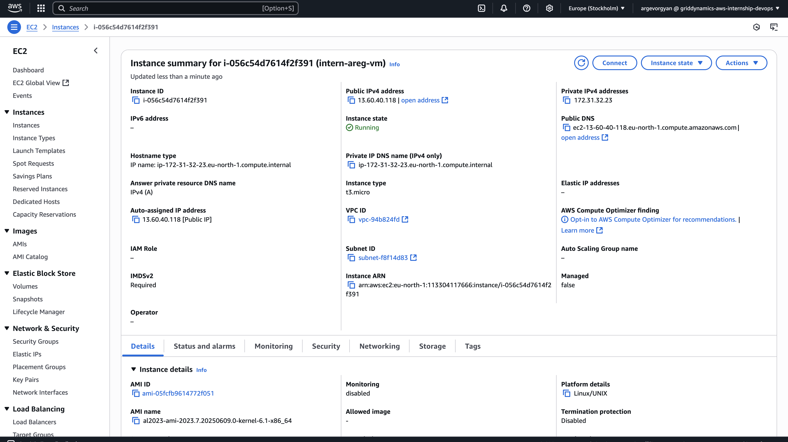

# Module 01 — Linux / EC2 Instance Launch

## Practical Task  
Deploy a virtual machine in AWS using Ubuntu and connect to it via SSH.

## Parameters Used
- **Region:** eu-north-1 (Stockholm) *(since launching in eu-west-1 was blocked by SCP)*
- **Instance Type:** t2.micro  
- **Key:** `ar_key.pem`  
- **Security Group:** `ssh-access` (port 22 open) — `sg-094a2a61d6669bb84` (`launch-wizard-40`)  
- **Tags:**
  - `Project`: 2025_internship_yvn
  - `Owner`: argevorgyan
  - `Name`: intern-vm-areg

## Steps

1. **Key Pair Creation:**
   - Name: `ar_key`
   - Type: `rsa`
   - Key was downloaded and saved locally.
   - Tags applied during creation:
     - `Name`: intern-ar-key
     - `Owner`: argevorgyan
     - `Project`: 2025_internship_yvn

2. **Instance Launch:**
   - Type: `t2.micro`
   - Region: `eu-north-1` (Stockholm), since `eu-west-1` was unavailable.
   - Selected previously created key: `ar_key.pem`.
   - Used existing Security Group with port 22 open for SSH.
   - Tags added during instance creation:
     - `Project`: 2025_internship_yvn
     - `Owner`: argevorgyan
     - `Name`: intern-vm-areg

3. **SSH Connection:**
   - After launching the instance, obtained its public IP.
   - Connected from local machine using the following command:
     ```bash
     ssh -i "ar_key.pem" ec2-user@ec2-13-60-216-242.eu-north-1.compute.amazonaws.com
     ```

## Result
- The virtual machine was successfully created and launched.
- SSH connection works properly.
- All parameters meet the task requirements.
- The instance was stopped after task completion.
- 
- 