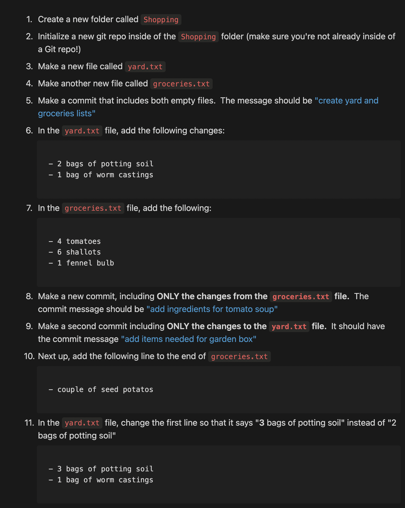

# Committing Basics Exercise

1. Created a new branch named 02-VCS-GIT. git checkout -b 
2. Created a folder called Shopping. 
3. Created two files inside Shopping: yard.txt and groceries.txt.
4. Committed both empty files with the message: git commit -m 
   create yard and groceries lists.
5. Added these lines to yard.txt: vim yard.txt
   - 2 bags of potting soil
   - 1 bag of worm castings
6. Added these lines to groceries.txt: vim groceries.txt
   - 4 tomatoes
   - 6 shallots
   - 1 fennel bulb
7. Committed with the message:
   add ingredients for tomato soup anditems needed for garden box
9. Updated the files:
   - Added “- couple of seed potatos” at the end of groceries.txt.
   - Changed the first line in yard.txt to:
     - 3 bags of potting soil
     - 1 bag of worm castings
10. Committed changes in both files with the message:
    add items needed to grow potatoes.
11. Checked commit history and confirmed there are 4 commits. git log 

