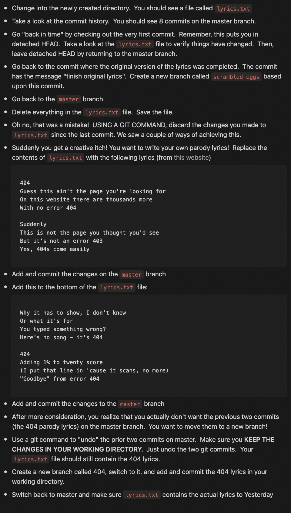
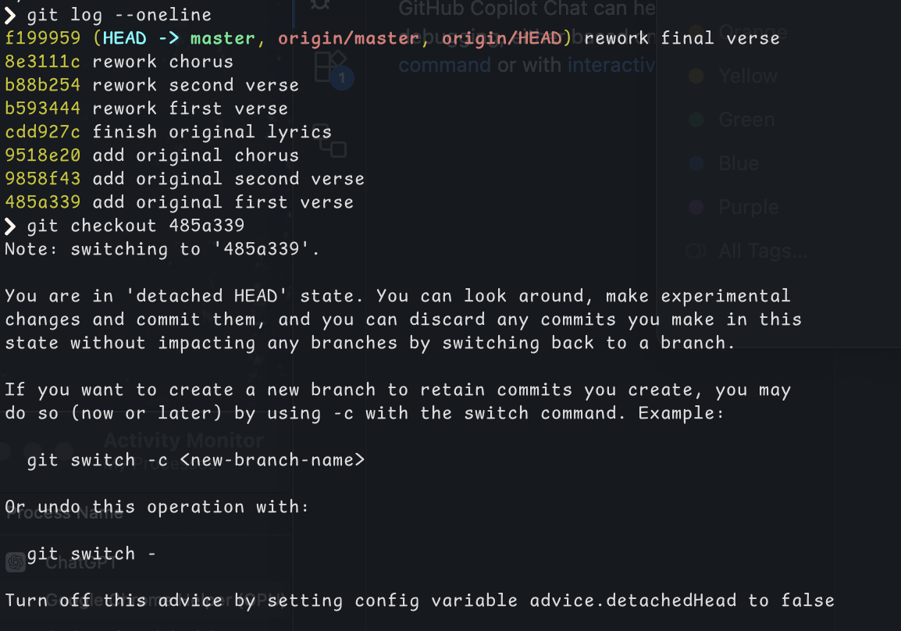
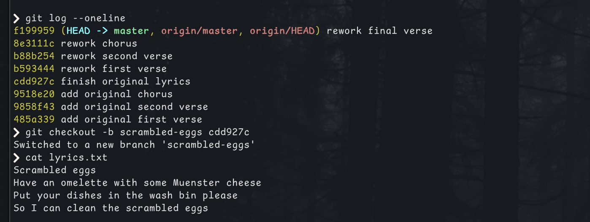
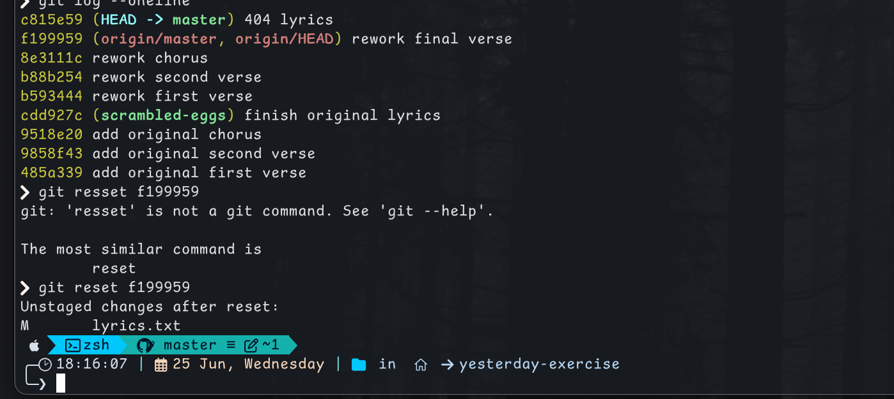
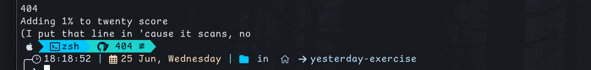
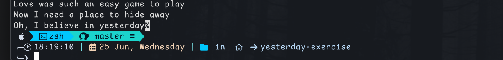

# Undoing Things – Git Exercise

---

## steps
	Viewed commit history: 
	Checked out the first commit (detached HEAD)
	Returned to master:

## Branch from a Previous Commit
	•	Found the commit with message: finish original lyrics
	•	Created a new branch from it:

⸻
## Undo Mistake (Reset File)
	•	Emptied lyrics.txt accidentally
	•	Reverted the change (before staging):

git checkout -- lyrics.txt

## 404 Parody Lyrics
	•	Replaced lyrics with parody version
	•	Committed:

git add lyrics.txt
git commit -m "404 lyrics"
## Move 404 Lyrics to a New Branch
	•	Created and committed on a new branch:

git checkout -b 404
git add lyrics.txt
git commit -m "Move 404 parody lyrics to separate branch"

⸻

🔹 Restore Original Lyrics to Master
	•	Switched back to master:

