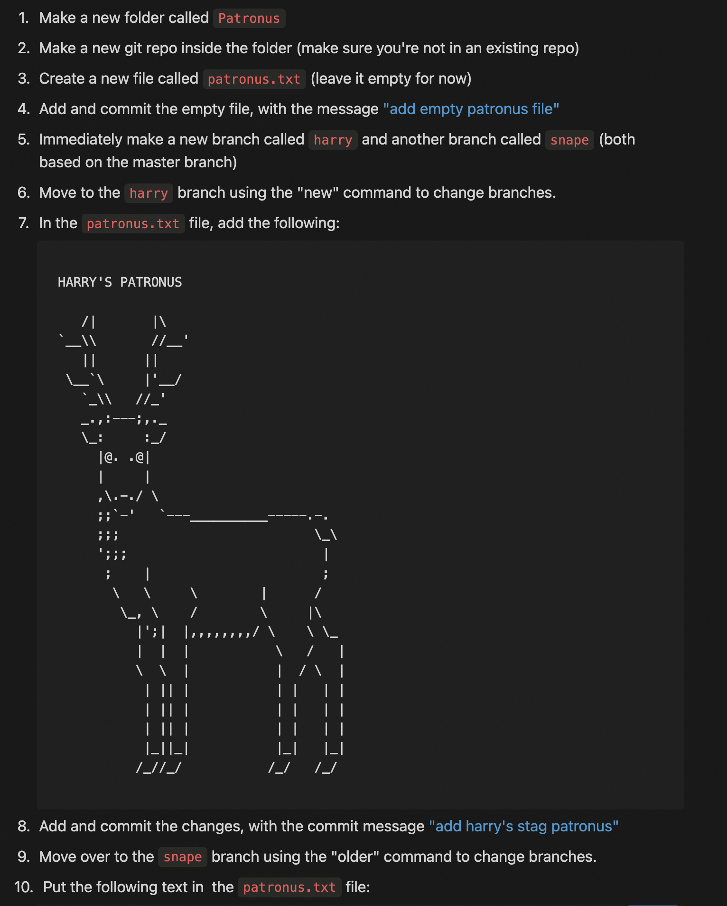
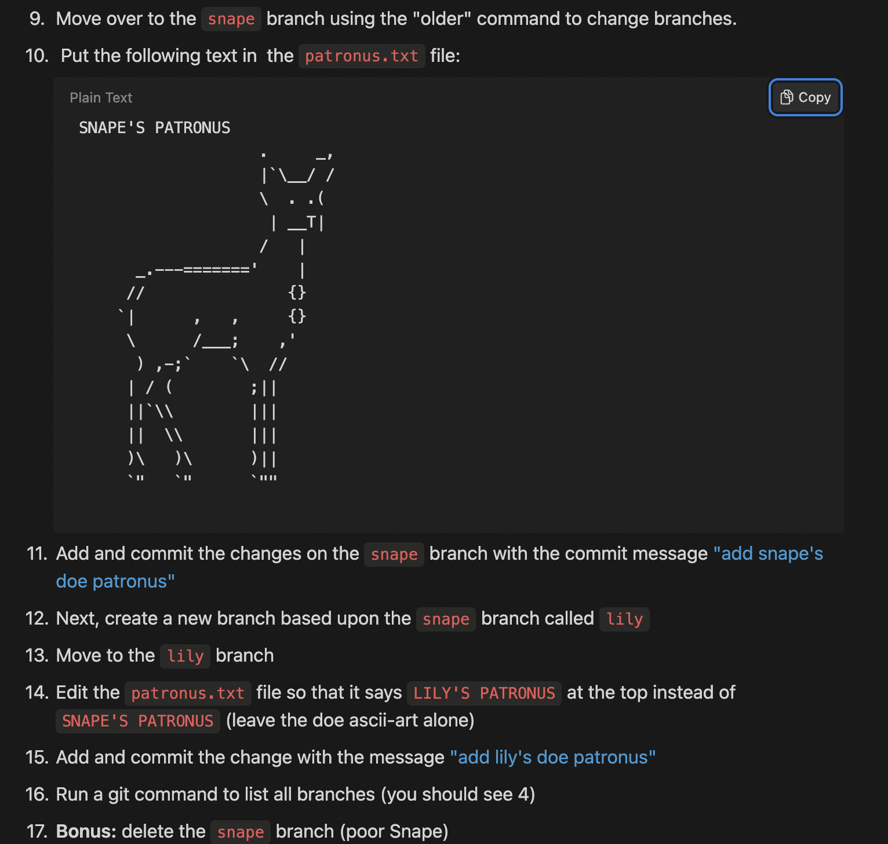
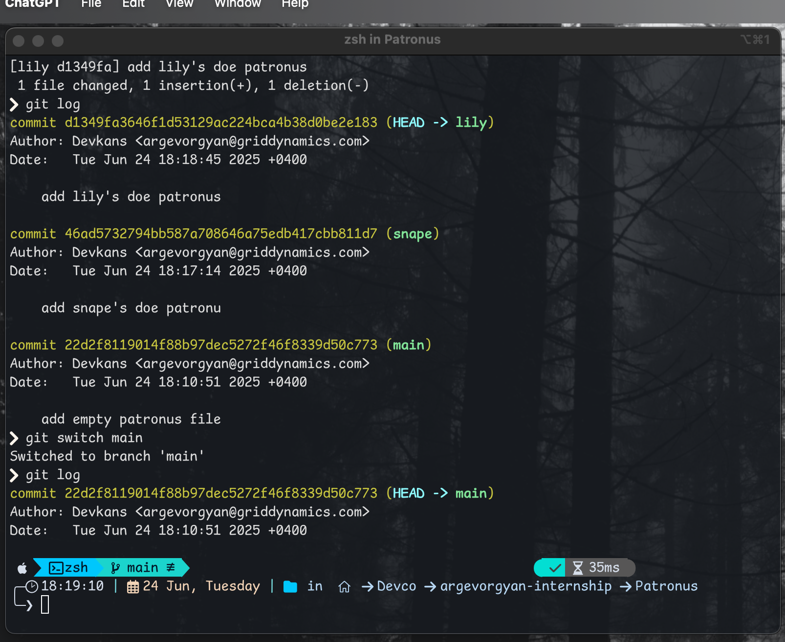

# Git Branching Exercise – Patronus



Created a `Patronus/` folder inside my `02-VCS-GIT` branch, initialized a new Git repository in it, then created an empty file and committed it:

```bash
mkdir Patronus && cd Patronus
git init
touch patronus.txt
git add patronus.txt
git commit -m "add empty patronus file"
```

creeated and worked with branches:
	•	harry: added harry’s stag patronus
	•	snape: added snape’s doe patronus
	•	lily: branched from snape, updated  to “LILY’S PATRONUS” by using checkout instead of branch

Deleted snape branch after creating lily.

All changes committed and verified via git log.

