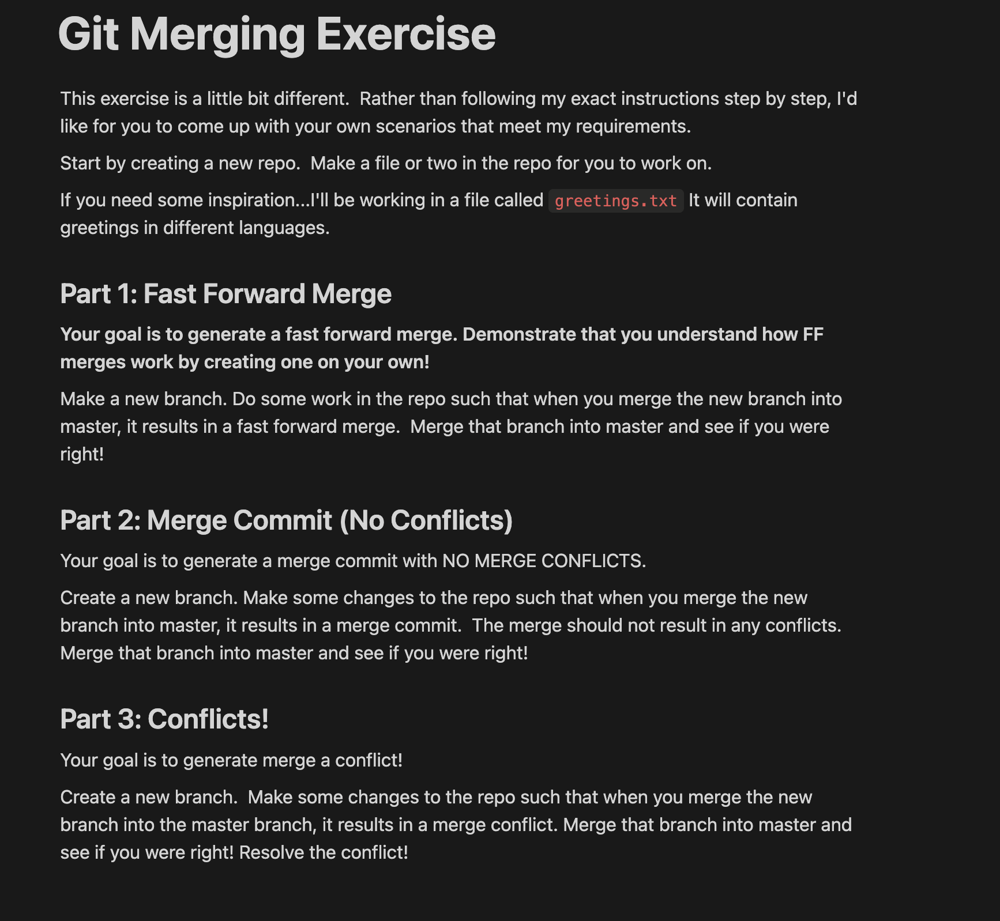
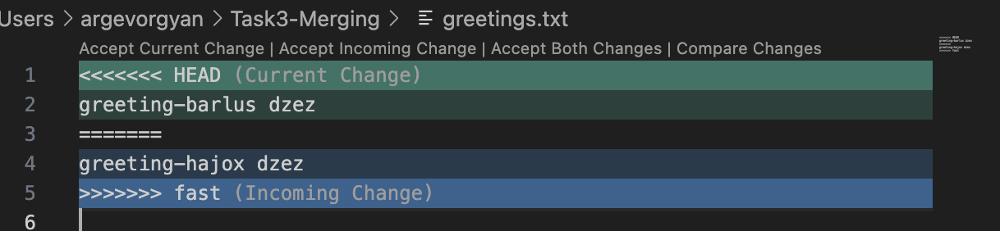

# Merging Exercise


## 🟢 Fast Forward Merge

- Created branch `fast`
```bash
git switch -c fast
```
- Added `greetings.txt` with:

greetings - barlus dzez

- Merged `fast` into `forward` branch using a **fast-forward merge**:
```bash
git checkout forward
git merge fast
```

## Merge Commit (No Conflicts)
	•	Added  changes to forward and fast independently.
	•	Merged forward into master:

git switch fast
git merge forward


⸻

## Merge Conflict 
	•	Created two branches that modified the same line in greetings.txt:
	•	One had: greeting - barlus dzez
	•	The other had: greeting - hajox dzez
	•	Merged them, causing a conflict.

Git reported a merge conflict in greetings.txt.
 Manually resolved it, added the file, and committed the merge.

⸻
