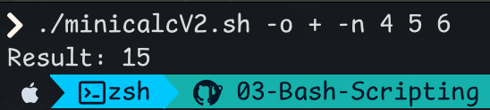
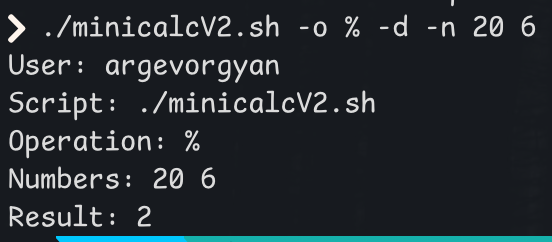

# Bash Mini Calculator Script

This script is a command-line calculator written in Bash that performs basic arithmetic operations on a sequence of integers using flags. It supports optional debug output and input validation.

---

## Features

- Supports operations: addition (`+`), subtraction (`-`), multiplication (`*`), and modulo (`%`)
- Accepts a list of integers via the `-n` flag
- Optional `-d` flag to show debug information
---

## 🧪 Usage

```bash
./minicalcV2.sh -o <operator> -d -n <num1> <num2> 
```

### Example 1: Addition




### Example 2: Mod with debug



---

## Validation

- If an invalid operator is given:

  ```bash
  ./minicalcV2.sh -o x -n 2 3
  # Output: Use +, -, *, or %.
  ```

- If fewer than two numbers are provided:

  ```bash
  ./minicalcV2.sh -o + -n 5
  # Output: At least two numbers are required after -n
  ```

- Division by zero in modulo:

  ```bash
  ./minicalcV2.sh -o % -n 10 0
  # Output: Error: Division by zero
  ```

---
