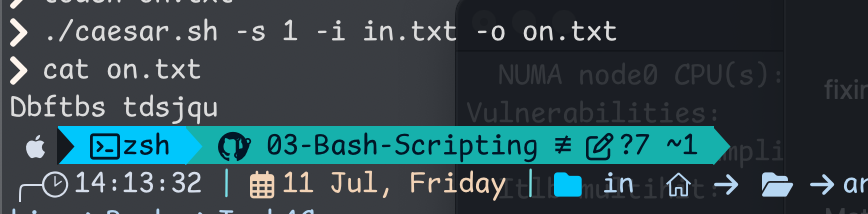
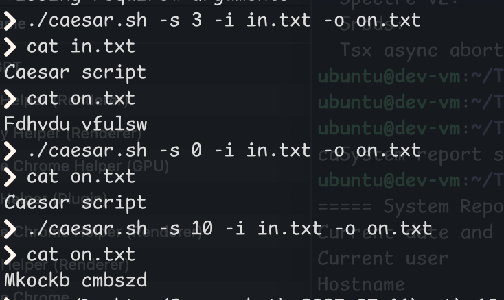

# Caesar Cipher Script

---

## Usage

```bash
./caesar.sh -s <shift> -i <input_file> -o <output_file>
```

### Arguments:

- `-s <shift>`: Integer shift amount (e.g. `3` shifts A→D, B→E, etc.)
- `-i <input_file>`: Path to the input text file
- `-o <output_file>`: Path to write the transformed output

---

##  How It Works

- **Argument Parsing**: Uses `getopts` to read `-s`, `-i`, and `-o`.
- **Validation**:
  - Ensures all required arguments are provided.
  - Checks if the input file exists.
- **Caesar Cipher Logic**:
  - Builds shifted uppercase and lowercase alphabets 
    ```bash
    shifted_upper="${upper:shift}${upper:0:shift}"
    ```
  - Use `tr` to translate characters from `A-Za-z` to the shifted version.

---

## Example

