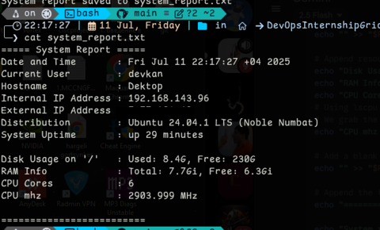
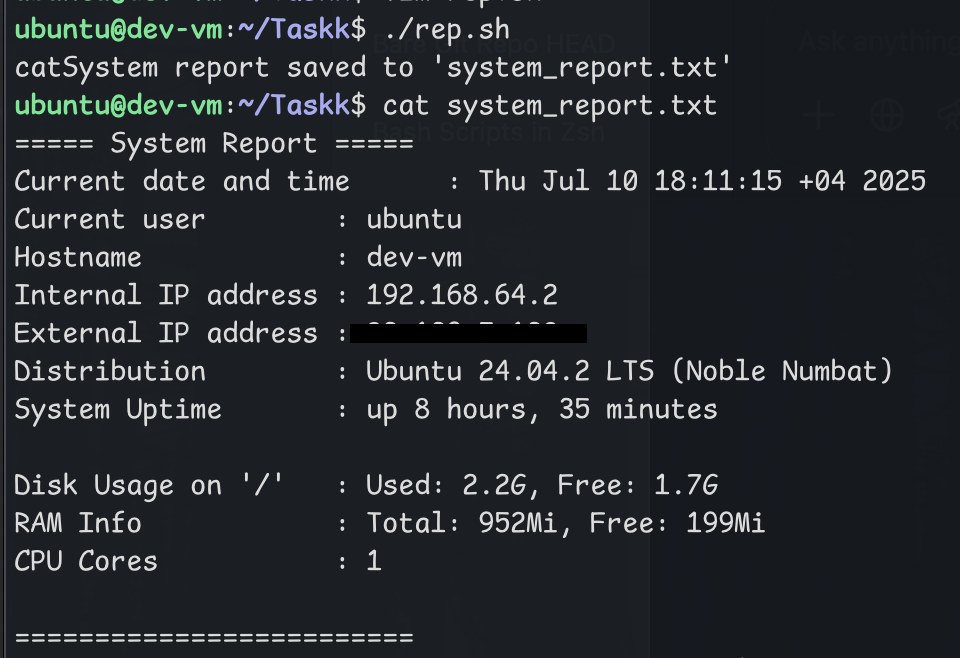

# System Report Script

This Bash script collects basic system information and writes it to a file called `system_report.txt`.

## What it shows:
- Current date and time
- Current logged-in user
- Hostname
- Internal IP address
- External IP address (via `curl` to ifconfig.me)
- OS distribution name and version
- System uptime
- Disk usage on `/`
- RAM usage  
- CPU core count
- CPU frequency (MHz)

##  Requirements

This script uses the following standard tools:
- `date`
- `whoami`
- `hostname`
- `awk`
- `df`
- `free`
- `uptime`
- `grep`
- `nproc`
- `curl` (for external IP)

##  Example Output

### Tested on WSL 

### Tested on multipass vm Before adding MHz

---