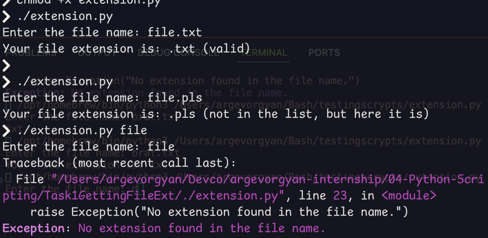

# File Extension Checker

- Accepts a file name
- Extracts the file extension (if any)
- Checks if the extension is in a list of commonly used valid extensions
- Raises an exception if the file has no extension
---

## Cases

### If the extension is valid, If the extension is not in the list,  If there's no extension

## Valid Extensions

Includes common types like:
- `.txt`, `.pdf`, `.docx`, `.jpg`, `.png`, `.mp3`, `.mp4`, `.py`, `.json`, `.zip`, etc.

I added a list of common file extensions to check for validation,  
but even if an extension is not in the list, the script will still print it —  
because I assume there are many valid extensions that may not be listed.
---