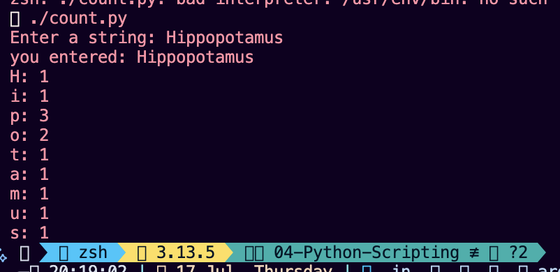

# Character occurance counter

script prompts the user to enter a string and prints how many times each **unique character** appears, 

## Features

- Counts how many times each character appears in the input string.
- Skips spaces entirely.
- Each character is shown **only once**, even if it appears multiple times.

## Example Usage

