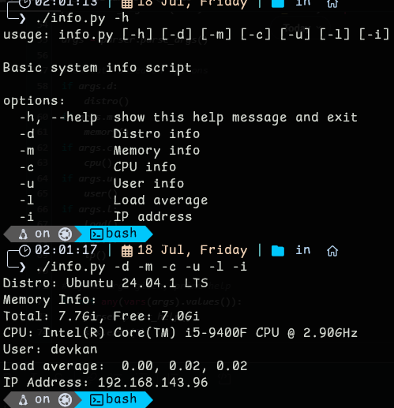
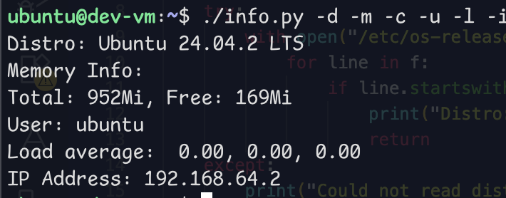

# System Info Script

This script  displays basic system information based on command-line options provided by the user

### Available Options:

| Flag | Description        
|------|--------------------
| `-d` | Show distro info   
| `-m` | Show memory info   
| `-c` | Show CPU info      
| `-u` | Show current user  
| `-l` | Show load average  
| `-i` | Show IP address    

### Example:

If no options are provided, the script will show a helpful usage message.

## Requirements

- Python 3
- Unix-like operating system (uses `/etc/os-release`, `free`, `uptime`, etc.)

