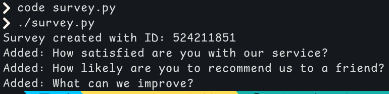

# SurveyMonkey Survey Creation Script

This script automates the creation of a survey on SurveyMonkey using their API. It reads survey data from a JSON file (`table.json`), creates the survey, adds a page, and fills it with questions and answers.

## Setup

Create a .env file in the same directory as the script with the following content:

**SURVEYMONKEY_API_KEY=your_api_access_token_here**

Replace your_api_access_token_here with your actual SurveyMonkey API token.
Prepare a table.json file containing your survey data.

The script will:
- Load the API key from the .env file.
- Read the survey title and questions from table.json.
- Create a new survey with the given title.
- Add a page to the survey.
- Add all questions and their answers to the page.
- Print the survey ID and the status of each question added.

## Example

## Possible enhancements

- Add error handling and retries for API rate limits.
- Support more question types beyond single-choice.
- Allow specifying page titles and multiple pages.
- Accept command-line arguments for flexibility (e.g., survey file path).

---

