# Jenkins Deployment on Tomcat with JMX Monitoring
In this task I set up Apache Tomcat, deploying Jenkins as a WAR application, enabling JMX for monitoring, and managing JVM parameters. Each step is documented with appropriate screenshots.

---

## 1. Download and install Tomcat

- Installed **Apache Tomcat 10.1.**
- Installed jdk
- Set `JAVA_HOME` and started Tomcat.

**Screenshot:**  
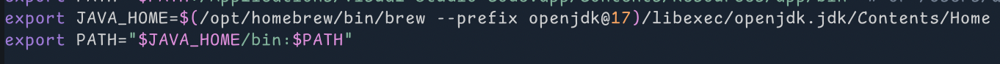
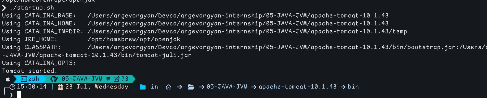


---

## 2. Tomcat root page

- Opened http://localhost:8080 in browser. 
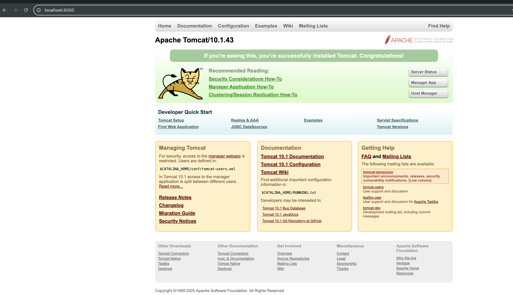

---

## 3. Identify process ports

Checked which ports the Java process was using:
:
- 8080 (HTTP)
- 8005 (shutdown)
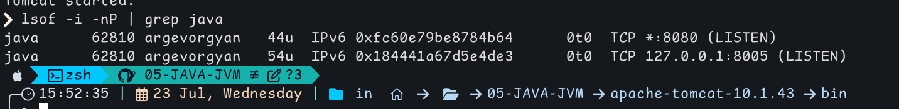

---

## 4. Remove def apps and access Jenkins

- Deleted default apps from `webapps/`
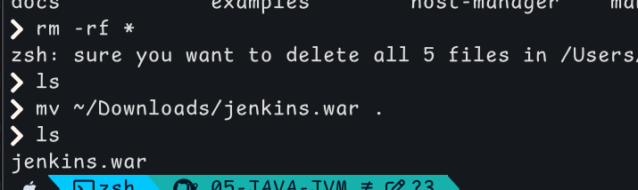

- Restarted Tomcat and accessed Jenkins at `http://localhost:8080/jenkins`
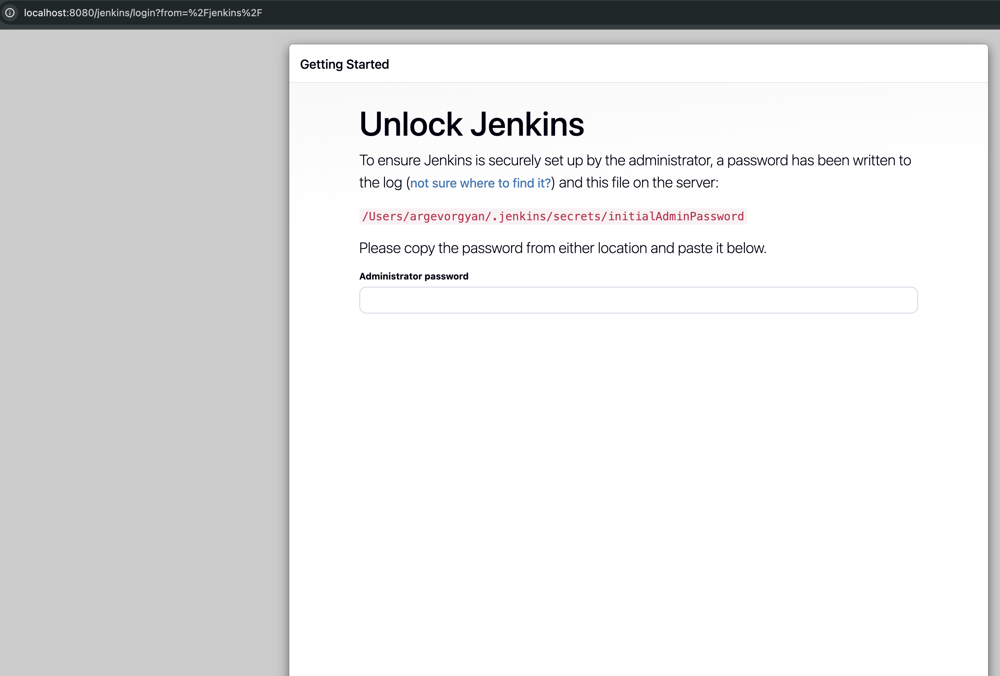

---

## 5. Enable JMX in Tomcat

Created `setenv.sh`
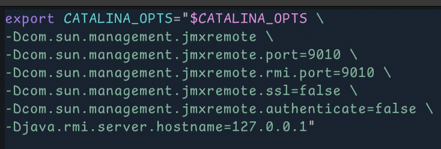

---

## 6. Check ports

```bash
lsof -i -nP | grep java
```

Expected ports:
- 8080
- 8005
- 9010 (JMX/RMI)  
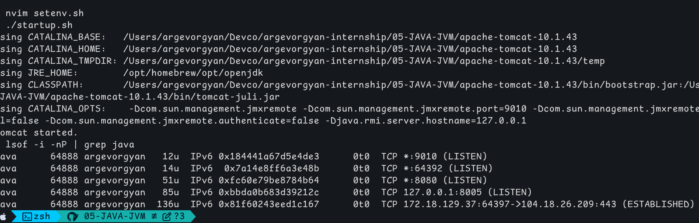

---

## 7. Reduce JVM Memory: Expect Errors

Tested with small memory config:
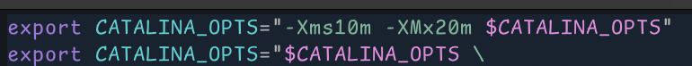

Expectt: `OutOfMemoryError`. 
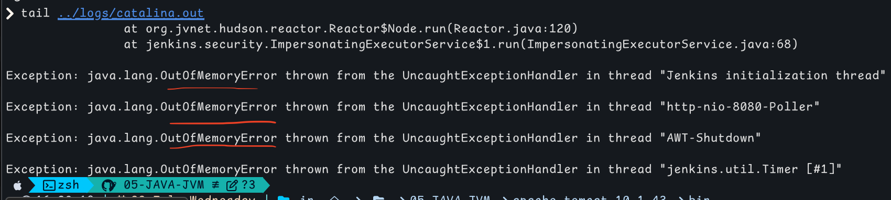

---

## 8. Increase JVM Memory & Enable GC

Set memory & garbage collector:
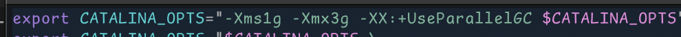

Restarted Tomcat. Jenkins ran successfully.


---

## 9. Monitor Jenkins Using JConsole

Started `jconsole` and connected locally.

- Overview
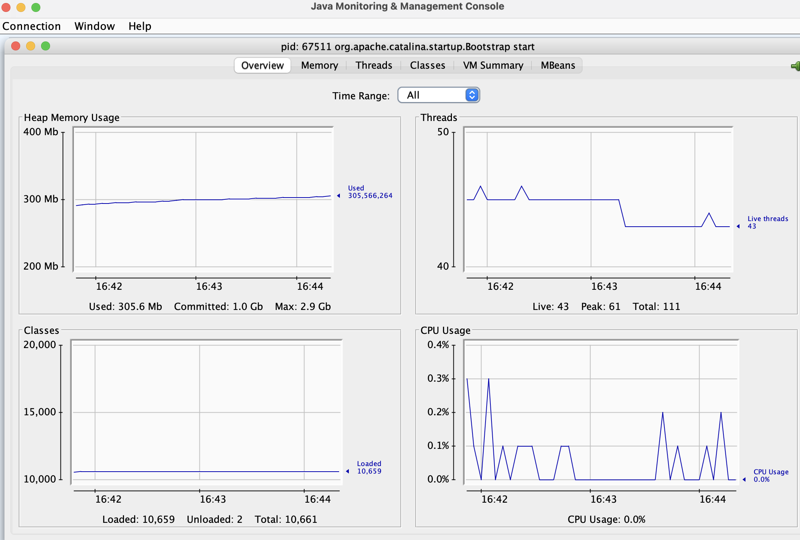
- Memory
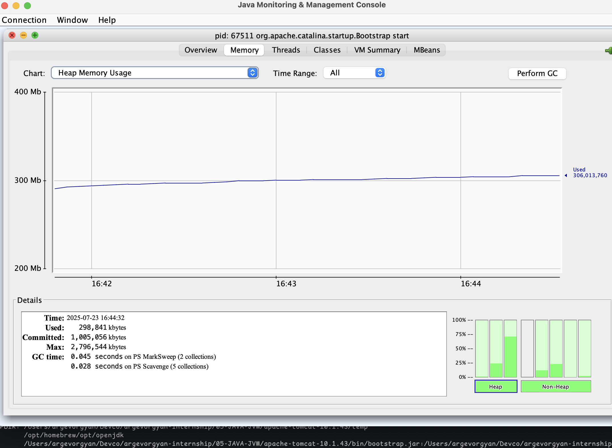
- Sum
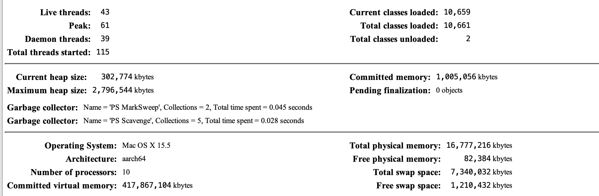
- Connect by port
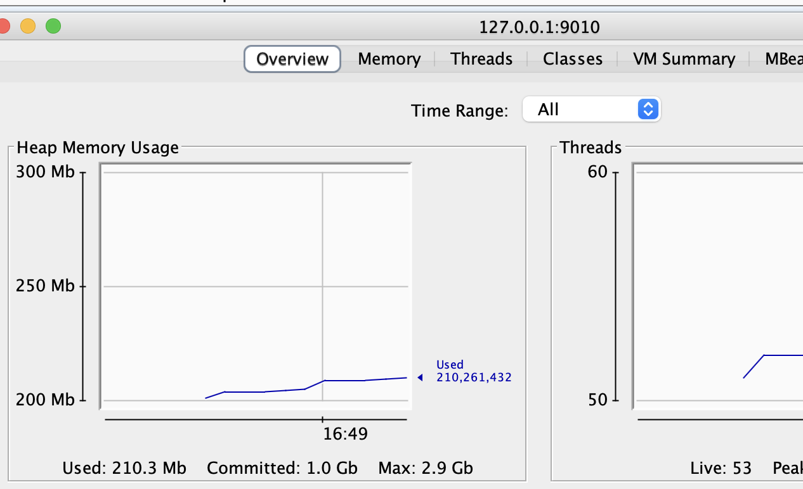

---

## 10. Run Jenkins Standalone 

Ran jenkins as standalone app (make sure jdk version supports it)
```bash
java -jar jenkins.war
``` 
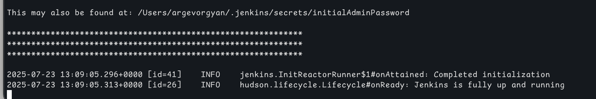

---
## Links

- [Jenkins WAR](https://www.jenkins.io/download/)
- [Tomcat Docs](https://tomcat.apache.org/tomcat-10.1-doc/monitoring.html)
- [Jenkins Java Requirements](https://www.jenkins.io/redirect/java-support/)
