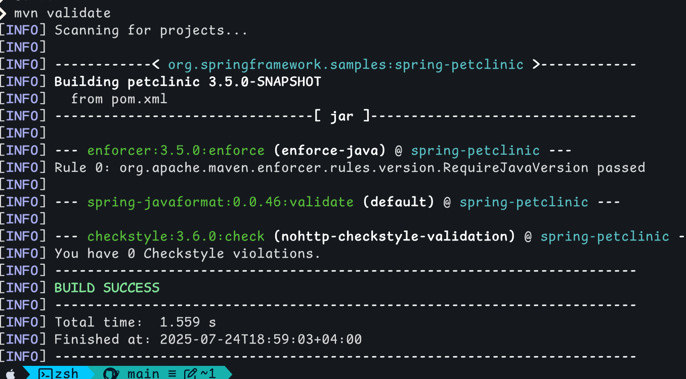
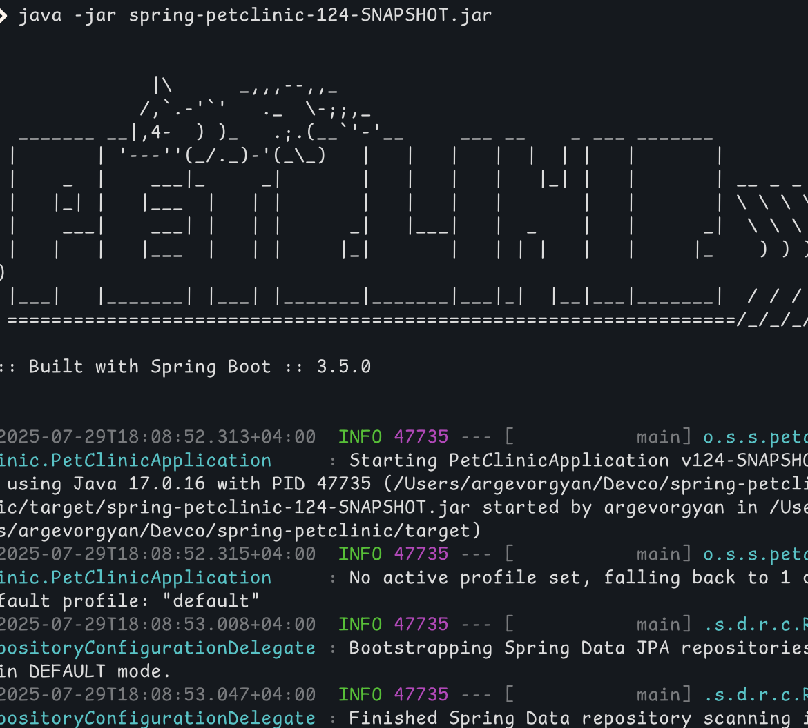
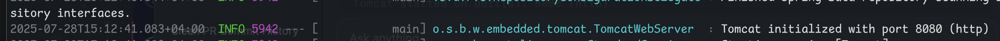
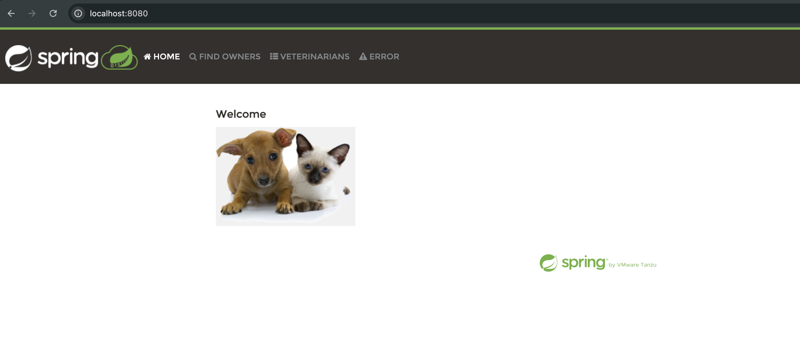
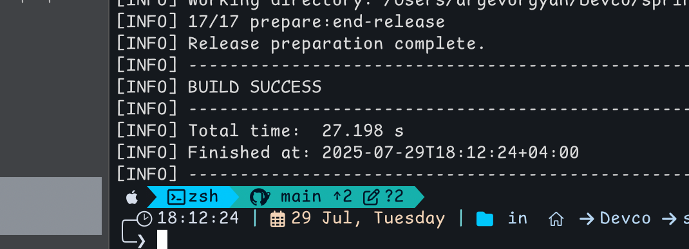
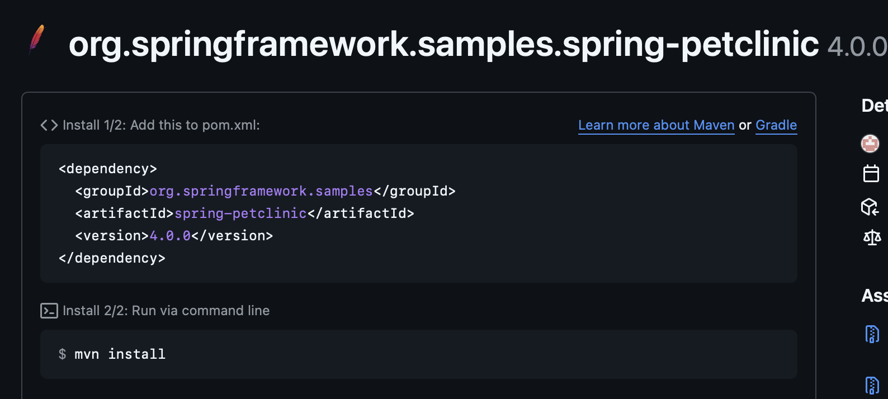
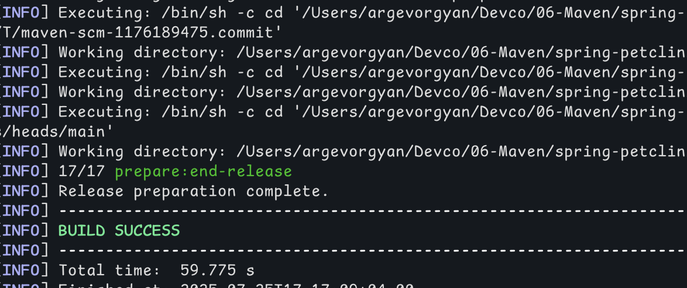
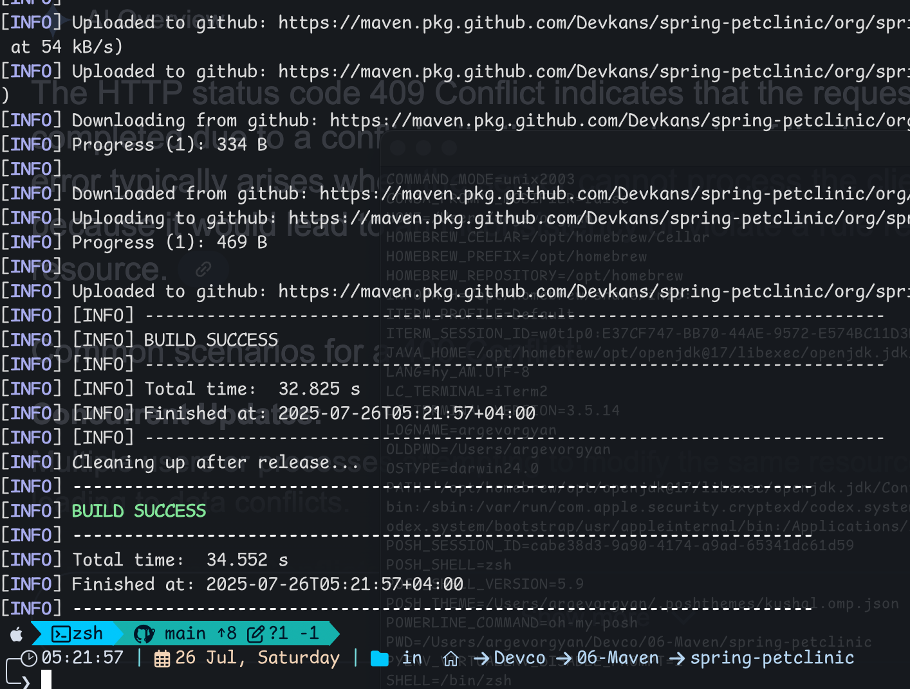
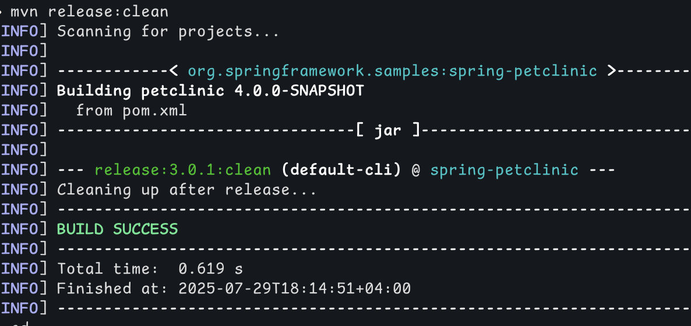

# Maven Release Setup for `spring-petclinic` Project

Maven release for a Java project (`spring-petclinic`) using the Maven Release Plugin and deploying artifacts to GitHub Packages..

---

## Goals

- Fork and clone the [`spring-petclinic`](https://github.com/spring-projects/spring-petclinic) repo
- Set up and test local Maven build.
- Use Maven Release Plugin to `prepare` and `perform` a release.

---

### 1. Validation check, build JAR and run app locally 

- `mvn install`
- `mvn validate`



- `mvn spring-boot:run`
OR
- java -jar spring-petclinic.jar

- `localhost:8080`





!


### 2. Configure `pom.xml`

- Added `scm` block for release plugin to link GitHub.
- Added `release` plugin 
- Added `distributionManagement` block:
```xml <scm>
<connection>s
    cm:git@github.com:Devkans/spring-petclinic.git  </connection>
    <developerConnection>
         scm:git:git@github.com:Devkans/spring-petclinic.git
    </developerConnection>
         <url>
          git@github.com:Devkans/spring-petclinic.git
        </url>
  <tag>pet-clinic-1.2</tag>
 </scm>
```

```xml
<plugin>
        <groupId>org.apache.maven.plugins</groupId>
        <artifactId>maven-release-plugin</artifactId>
        <version>3.0.1</version>
        <configuration>
          <localCheckout>true</localCheckout>
        </configuration>
      </plugin>
```
- 	Adding `distributionManagement` block to pom.xml was essential. It tells Maven where to push release artifacts. Without it `release:perform` threw repository element was not specified or skiped deploy.

```xml
<distributionManagement>
   <repository>
     <id>github</id>
     <name>GitHub OWNER Apache Maven Packages</name>
     <url>https://maven.pkg.github.com/Devkans/spring-petclinic</url>
  
      </repository>
       <snapshotRepository>
     <id>github</id>
     <name>GitHub OWNER Apache Maven Packages</name>
     <url>https://maven.pkg.github.com/Devkans/spring-petclinic</url>
   </snapshotRepository>
</distributionManagement>
```
`localCheckout=true`  helped to get the `release:perform` to work in a local fork without relying on pushing and recloning the repo.


### 3. Configured `~/.m2/settings.xml`

```xml
<settings>
  <servers>
   <!--server ID must match the in distributionManagement -->
    <server>
      <id>github</id>
      <username>Devkans</username>
      <password>${env.MACTOKEN}</password>
    </server>
  </servers>

  <profiles>
    <profile>
      <id>github</id>
      <repositories>
        <repository>
          <id>github</id>
          <!-- github packages repository url -->
          <url>https://maven.pkg.github.com/Devkans/spring-petclinic</url>
        </repository>
      </repositories>
    </profile>
  </profiles>

<!-- make default -->
  <activeProfiles>
    <activeProfile>github</activeProfile>
  </activeProfiles>
</settings>
```
---

### 4. Run Maven Release Plugin

#### Prepare
-In non-Interacctive Mode 
```bash
  mvn --batch-mode -Dtag=pet-clinic-1.3 release:prepare \
                 -DreleaseVersion=4.0.0 \
                 -DdevelopmentVersion=4.0.0-SNAPSHOT
```




It will:
- Tag the release
- Commit the updated version numbers

#### Perform
`mvn release:perform `

deploys the artifacts

#### Cleanup
`mvn release:clean`



## Common issues and fixes

| Error | Cause | Fix |
|-------|-------|-----|
| `401 Unauthorized` | Missing token | Used a valid GitHub Classic token |
| `403 Forbidden` | Incorrect repo URL or insufficient permissions | Check `distributionManagement` and token scopes |
| `repository element was not specified` | Missing `distributionManagement` | Ensure it's present in `pom.xml` |

---

## Lessons Learned

- Naming must be consistent in `pom.xml`, GitHub repo, and artifact structure. Even one mismatch can break the deploy.
- GitHub Package works  when configured with proper `distributionManagement` and `server` entries.
- This issue is similar to Ansible roles: when `group_vars` or `inventory` names don’t match, variables aren’t loaded—same happens in Maven with mismatched `groupId`.

---

## Done

After completing, the deployed artifacts appeared in:
[https://github.com/Devkans/spring-petclinic/packages](https://github.com/Devkans/spring-petclinic/packages)
