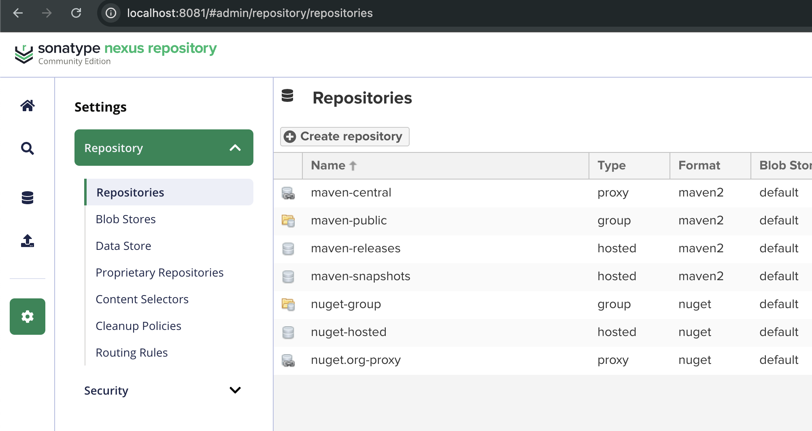

# Nexus setup and artifact deployment


---

## Created docker volume and installed nexus

```bash
docker volume create nexus-vol
docker run -d -p 8081:8081 --name nexus  -v nexus-vol:/nexus-vol sonatype/nexus3
```

Then check on [http://localhost:8081](http://localhost:8081)


---

## Got password for first-time Login

```bash
docker exec -it nexus cat /nexus-data/admin.password
```

---

## Created proxy repository




It allows Maven to download dependencies through Nexus

---

## Configured settings.xml to get for nexus access and  distribution management in pom.xml

Edit `~/.m2/settings.xml`:

```xml
 <mirrors>
    <mirror>
      <id>nexus</id>
      <mirrorOf>*</mirrorOf>
      <url>http://localhost:8081/repository/maven-petclinic/</url>
    </mirror>
  </mirrors>
 
  <servers>
    <server>
      <id>nexus</id>
      <username>admin</username>
      <password>${env.NEXUSTOKEN}</password>
    </server>
  </servers>
```

```xml
 <distributionManagement>
  <repository>
    <id>nexus</id>
    <url>http://localhost:8081/repository/maven-releases/</url>
  </repository>
  <snapshotRepository>
    <id>nexus</id>
    <url>http://localhost:8081/repository/maven-snapshots/</url>
  </snapshotRepository>
</distributionManagement>
```

- For snapshot deploy: `<version>4.0.0-SNAPSHOT</version>`
- For release deploy: `<version>4.0.0</version>`

---

## Artifact deployment to Nexus

### Option 1: Simple Deploy

```bash
mvn clean deploy
```

This will send artifacts to
- `maven-snapshots` if the version ends with `-SNAPSHOT`
- `maven-releases` otherwise

### Option 2: using release plugin
```bash
mvn release:prepare -B \
  -DreleaseVersion=4.0.0 \
  -DdevelopmentVersion=4.0.1-SNAPSHOT \
  -Dtag=release-4.0.0

mvn release:perform
```

---

## Check artifacts in Nexus


