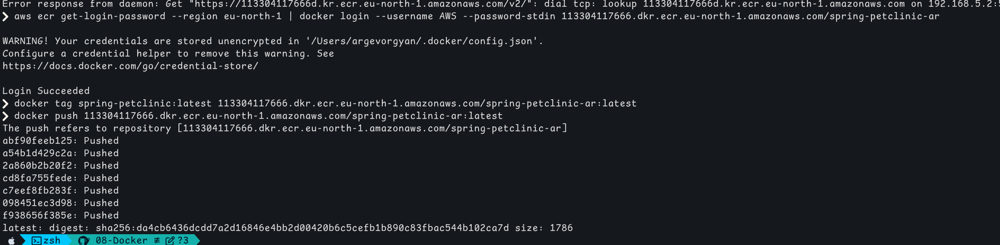

# Docker module practical tasks


## Dockerizing with pre-built artifact

I already had the pre-built `.jar` in the `target/` folder, so I used it directly in the Docker image.  
If not I would run `./mvn clean package` to build it manually

### Dockerfile

```Dockerfile
FROM openjdk:17-jdk-slim
WORKDIR /app
COPY target/spring-petclinic*.jar app.jar
ENTRYPOINT ["java", "-jar", "app.jar"]
```

```bash
docker build -t petclinic .
docker run -p 8080:8080 petclinic
```

# 2. Multi-Stage build

### Dockerfile (multi-stage)

I configured Maven to use a local nexus mirror by copying in settings.xml. This speeds up builds by avoiding downloads from maven central.

```Dockerfile
#build
FROM maven:3-eclipse-temurin-21-alpine AS build

WORKDIR /app

ARG DOCKERNEXUS
ENV DOCKERNEXUS=${DOCKERNEXUS}

COPY settings.xml /root/.m2/settings.xml

COPY pom.xml .

RUN mvn dependency:go-offline -B

COPY src ./src

RUN mvn clean package -DskipTests -B \
    && rm -rf /root/.m2  

#run 
FROM eclipse-temurin:21-jre-alpine

WORKDIR /app

COPY --from=build /app/target/*.jar app.jar

EXPOSE 8080

ENTRYPOINT ["java", "-Djava.awt.headless=true", "-jar", "app.jar"]

```


---

## 3. Docker Compose

Credentials passed in `.env` file.

### .env

```env
POSTGRES_USER=petclinic
POSTGRES_PASSWORD=petclinic
POSTGRES_DB=petclinic
```


### docker-compose.yml

```yaml
version: "3.9"

services:
  spring-petclinic:
    build:
      context: ./
      args:
        DOCKERNEXUS: ${DOCKERNEXUS}
    image: spring-petclinic:latest
    ports:
      - "8079:8080"
    environment:
      SPRING_PROFILES_ACTIVE: postgres
    depends_on:
      - postgres
    env_file:
      - .env

  postgres:
    image: postgres:15-alpine
    environment:
      POSTGRES_DB: petclinic
      POSTGRES_USER: ${POSTGRES_USER}
      POSTGRES_PASSWORD: ${POSTGRES_PASSWORD}
    env_file:
      - .env
    volumes:
      - postgres_container:/var/lib/postgresql/data

volumes:
  postgres_container:


```

```bash
docker-compose up --build
```

[http://localhost:8079](http://localhost:8079)

---

## Added Data


---
# Task2  - Uploading Docker image to Nexus and AWS ECR


---

## Push image to Nexus
Created Docker hosted repository in Nexus named it docker-hosted


Configured the repository to run on port `5000` for Docker push and pull and recreated the container to map port 5000

 tag image to match nexus repos port and address

  ```bash
  docker tag spring-petclinic localhost:5000/spring-petclinic:latest
  ```
---
- Login


  

- Pushed Docker image to Nexus
  

- Check

```
docker run -p 8080:8080 localhost:5000/spring-petclinic:latest
```

---

## AWS ECR Repository Setup and Upload

- Created a private repository in elastic container registry


- Created access key

- Authenticated Docker with AWS ECR with cli
Configured
- Pushed the image to the AWS ECR repository


---
- Security scan


- Conclusionx

I will switch to lighter image that doesn't include vulnerable pearl dependency or remove the package during building stage
### Notes

- Container mapping cannot be changed after container is created, must recreate it with updated settings
- Nexus runs on port `8081` and docker-hoster repo on `5000`
- Use `docker tag` properly to match the registry and repository paths!
 - AWS CLI must be configured (`aws configure`) before working with ECR

---

