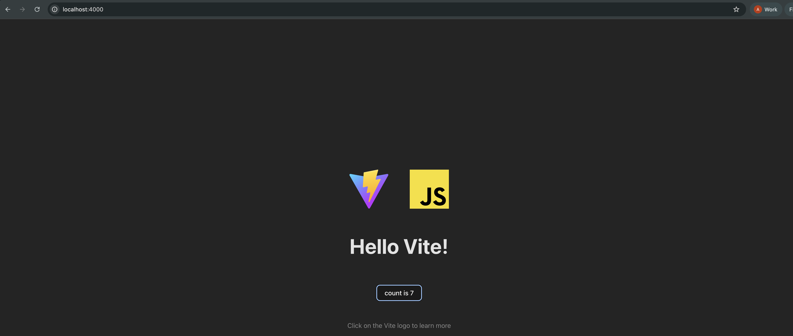
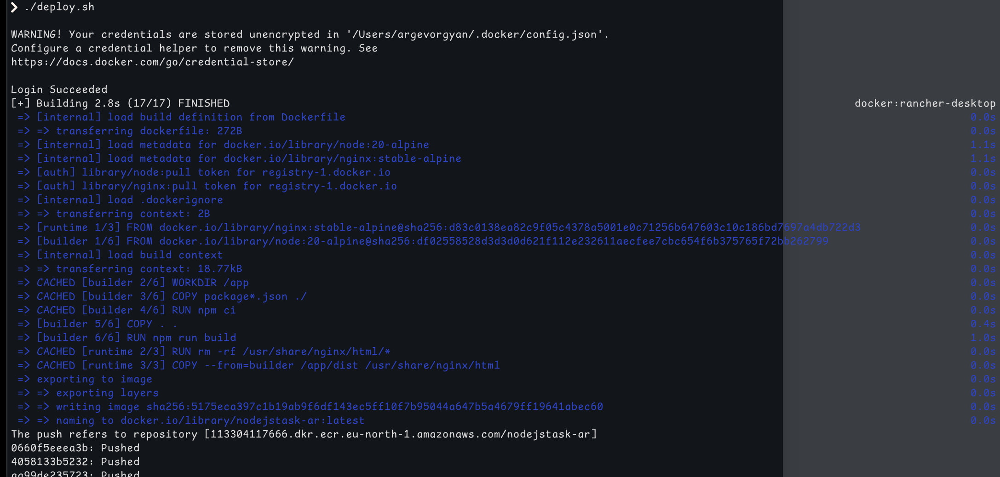
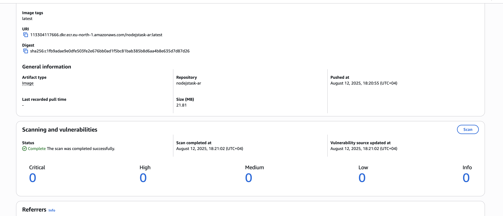

# statis build and ecr push script

## Steps

1. created simple project with vite that build static site 

`npm create vite@latest statictest -- --template vanilla`


2. **Dockerfile**
```FROM node:20-alpine AS builder

WORKDIR /app

COPY package*.json ./

RUN npm ci

COPY . .
RUN npm run build

FROM nginx:stable-alpine AS runtime

RUN rm -rf /usr/share/nginx/html/*
COPY --from=builder /app/dist /usr/share/nginx/html
```

4. **Automation Script*

   This script logs in to ECR, builds the Docker image, tags it with the correct repository name and tag and finally pushes it to aws
   variables AWS_REGION and AWS_ACCOUNT_ID are defined in ~/.zshrc
   ```bash
   #!/bin/bash
   AWS_REGION="eu-north-1"
   AWS_ACCOUNT_ID="113304117666"
   IMAGE_NAME="nodejstask-ar"
   IMAGE_TAG="latest"

   aws ecr get-login-password --region $AWS_REGION | \
   docker login --username AWS --password-stdin $AWS_ACCOUNT_ID.dkr.ecr.$AWS_REGION.amazonaws.com

   docker build -t $IMAGE_NAME:$IMAGE_TAG .

   docker tag $IMAGE_NAME:$IMAGE_TAG \
   $AWS_ACCOUNT_ID.dkr.ecr.$AWS_REGION.amazonaws.com/$IMAGE_NAME:$IMAGE_TAG

   docker push $AWS_ACCOUNT_ID.dkr.ecr.$AWS_REGION.amazonaws.com/$IMAGE_NAME:$IMAGE_TAG
   ```
   
   
   ## Vulnerability check 


