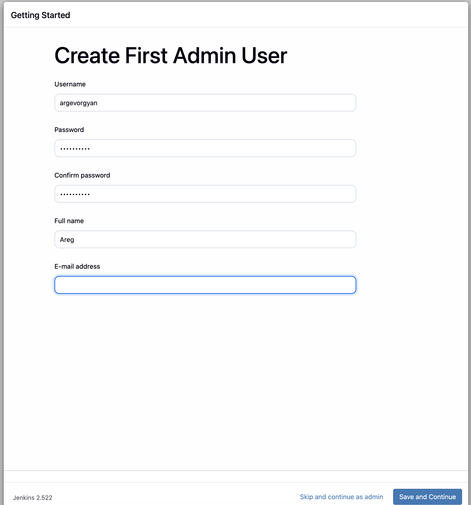
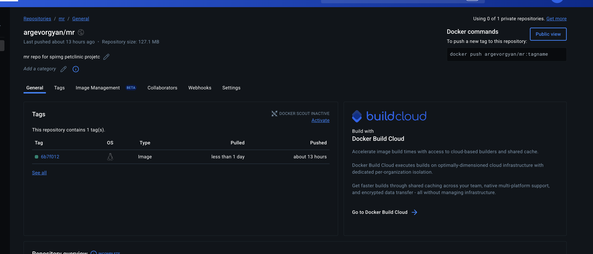

# Jenkins Pipeline for Building and Pushing Docker Images


---
### 2. Jenkins configuration 

- Ran Jenkins and configured admin user 

- Installed necessary plugins for Docker integration:
  
  - Added all necessary  credentials dockerhub, git

### 2. Docker Hub Setup

Created two repositories on Docker Hub:
  - `main` for `main` branch builds
  - `mr`  for merge request branch builds

  

### 3. Pipeline Configuration
- Added a `Jenkinsfile` in the project repository with these stages:
  ```groovy

  pipeline {
    agent any

    environment {
        DOCKERHUB_USER = 'argevorgyan'
    }

    stages {
        stage('Checkout') {
            steps {
                checkout scm
                script {
                    env.SHORT_GIT_COMMIT = sh(script: 'git rev-parse --short HEAD', returnStdout: true).trim() // short commit hash
                }
            }
        }

        // Merge Request Pipeline Stages
        stage('Checkstyle') {
            when {
                not { branch 'main' }
            }
            steps {
                sh 'mvn checkstyle:checkstyle'
            }
        }

        stage('Test') {
            when {
                not { branch 'main' }
            }
            steps {
                sh 'mvn test'
            }
        }

        stage('Build') {
            when {
                not { branch 'main' }
            }
            steps {
                sh 'mvn clean package -DskipTests'
            }
        }

        stage('Build Docker Image') {
            steps {
                script {
                    def repo = env.BRANCH_NAME == 'main' ? 'main' : 'mr'
                    sh "docker build -t ${DOCKERHUB_USER}/${repo}:${SHORT_GIT_COMMIT} ."
                }
            }
        }

        stage('Push to Docker Hub') {
            steps {
                withCredentials([usernamePassword(
                    credentialsId: 'dockerhub-creds',
                    usernameVariable: 'DOCKERHUB_USERNAME',
                    passwordVariable: 'DOCKERHUB_PASSWORD' 
                )]) {
                    sh """
                        echo "${DOCKERHUB_PASSWORD}" | docker login -u "${DOCKERHUB_USERNAME}" --password-stdin 
                        docker push ${DOCKERHUB_USER}/${env.BRANCH_NAME == 'main' ? 'main' : 'mr'}:${SHORT_GIT_COMMIT}
                    """
                } // if branch is main, push to main repo, else push to mr repo 
            }
        }
    }


### 4. Running the Pipeline




---
