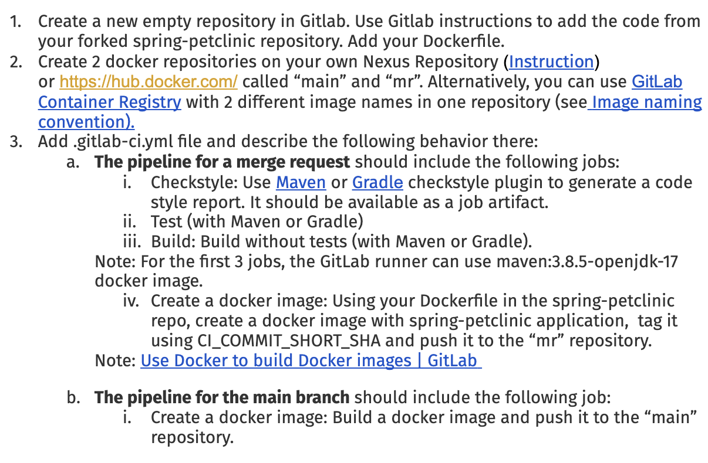
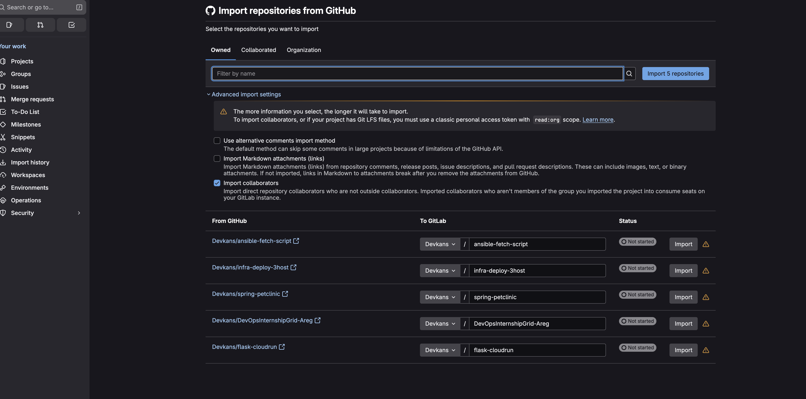
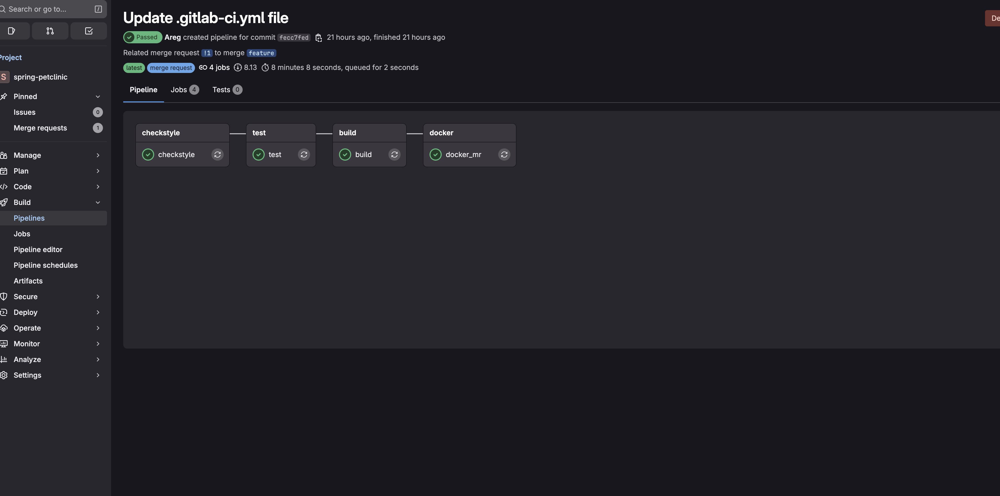
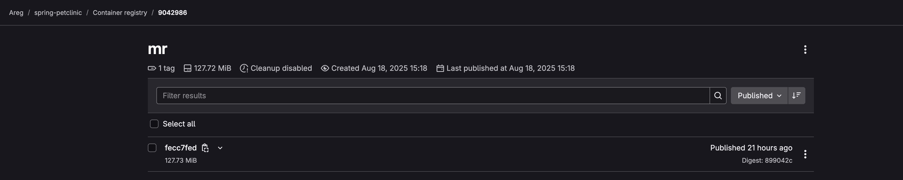

# Spring Petclinic CI/CD with GitLab




---

## Steps
- Imported the project from GitHub
  
- Configured GitLab CI/CD to build, test, and package the app using maven
```groovy
stages:
  - checkstyle
  - test
  - build
  - docker

variables:
  MR_IMAGE: "registry.gitlab.com/devkans/spring-petclinic/mr:$CI_COMMIT_SHORT_SHA"
  MAIN_IMAGE: "registry.gitlab.com/devkans/spring-petclinic/main:$CI_COMMIT_SHORT_SHA"

default:
  image: maven:3.8.5-eclipse-temurin-17-alpine

checkstyle:
  stage: checkstyle
  rules:
    - if: '$CI_PIPELINE_SOURCE == "merge_request_event"'
  script:
    - mvn --batch-mode checkstyle:checkstyle
  artifacts:
    paths: [target/checkstyle-result.xml]
    expire_in: 1 week

test:
  stage: test
  rules:
    - if: '$CI_PIPELINE_SOURCE == "merge_request_event"'
  script:
    - mvn --batch-mode test

build:
  stage: build
  rules:
    - if: '$CI_PIPELINE_SOURCE == "merge_request_event"'
  script:
    - mvn --batch-mode clean package

# docker job using extends
.docker_template:
  stage: docker
  image: docker:24.0.5
  services: [docker:24.0.5-dind]
  script:
    - echo "$CI_REGISTRY_PASSWORD" | docker login -u "$CI_REGISTRY_USER" --password-stdin "$CI_REGISTRY"
    - docker build -t "$IMAGE_NAME" .
    - docker push "$IMAGE_NAME"

docker_mr:
  extends: .docker_template
  rules:
    - if: '$CI_PIPELINE_SOURCE == "merge_request_event"'
  variables:
    IMAGE_NAME: "$MR_IMAGE"

docker_main:
  extends: .docker_template
  rules:
    - if: '$CI_COMMIT_BRANCH == "main"'
  variables:
    IMAGE_NAME: "$MAIN_IMAGE"
```
  - Built Docker imagesg for merge requests and main branch.  

 - Deployed images to GitLab container registry
 
 
---
