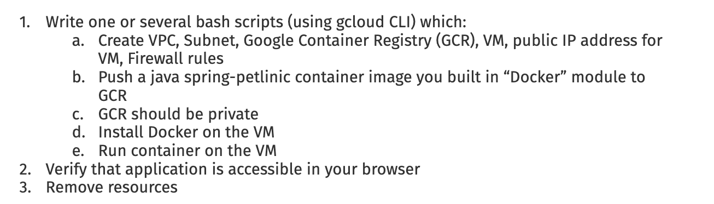
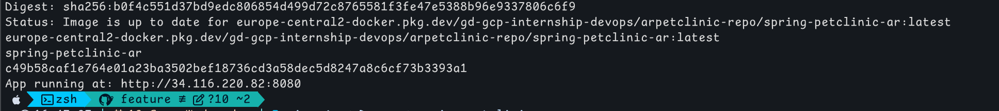
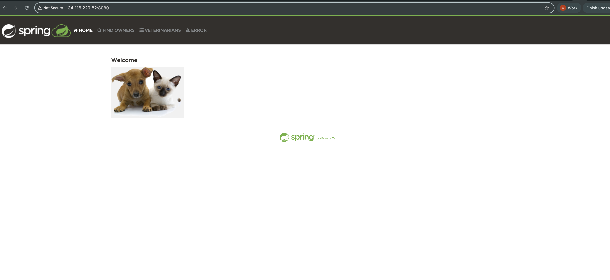
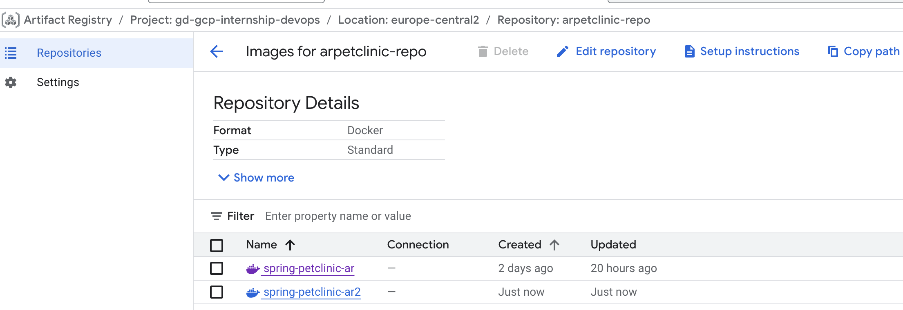

# Deploy Spring Petclinic on GCP with GCR and VM



---
## Script
```bash
#!/usr/bin/env bash
# GCP Petclinic Deployment Script
# Usage
#   ./gcp.sh up     # create infra + VM
#   ./gcp.sh install_docker # install Docker on VM
#   ./gcp.sh push   # push image to Artifact Registry
#   ./gcp.sh run    # run container on VM
#   ./gcp.sh down   # cleanup
#   ./gcp.sh start  # start VM
#   ./gcp.sh stop   # stop VM

set -euo pipefail
source .env

up() {

  # Networking
  if ! gcloud compute networks describe $NETWORK &>/dev/null; then
    gcloud compute networks create $NETWORK --subnet-mode=custom
  fi

  if ! gcloud compute networks subnets describe $SUBNET --region=$REGION &>/dev/null; then
    gcloud compute networks subnets create $SUBNET \
      --network=$NETWORK --region=$REGION --range=10.10.0.0/24
  fi

  if ! gcloud compute firewall-rules describe petallow-ssh &>/dev/null; then
    gcloud compute firewall-rules create petallow-ssh --network=$NETWORK --allow=tcp:22
  fi
  if ! gcloud compute firewall-rules describe petallow-http &>/dev/null; then
    gcloud compute firewall-rules create petallow-http --network=$NETWORK --allow=tcp:$PORT
  fi

  if ! gcloud compute addresses describe $IP --region=$REGION &>/dev/null; then
    gcloud compute addresses create $IP --region=$REGION
  fi
  ADDR=$(gcloud compute addresses describe $IP --region=$REGION --format='value(address)')

  if ! gcloud compute instances describe $VM --zone=$ZONE &>/dev/null; then
    gcloud compute instances create $VM \
      --zone=$ZONE --machine-type=e2-medium --subnet=$SUBNET \
      --address=$ADDR --image-family=debian-12 --image-project=debian-cloud \
      --service-account=$SERVICE_ACCOUNT \
      --scopes=https://www.googleapis.com/auth/cloud-platform
  fi

  if ! gcloud artifacts repositories describe $REPO --location=$REGION &>/dev/null; then
    gcloud artifacts repositories create $REPO \
      --repository-format=docker \
      --location=$REGION \
      --description='Spring Petclinic Docker repo'
  fi
}

install_docker() {
  gcloud compute ssh $VM --zone=$ZONE --command \
    "sudo apt-get update && sudo apt-get install -y docker.io && sudo systemctl enable --now docker"
}

push() {
  gcloud auth configure-docker europe-central2-docker.pkg.dev --quiet

  docker buildx use mybuilder

  docker buildx build \
    --platform linux/amd64,linux/arm64 \
    -t europe-central2-docker.pkg.dev/gd-gcp-internship-devops/arpetclinic-repo/spring-petclinic-ar:latest \
    . --push
}

run() {
  gcloud compute ssh $VM --zone=$ZONE --command "
    sudo gcloud auth configure-docker $REGION-docker.pkg.dev -q

    sudo docker pull $IMAGE

    sudo docker rm -f spring-petclinic-ar || true
    sudo docker run -d --name spring-petclinic-ar -p 8080:8080 $IMAGE
  "

  ADDR=$(gcloud compute addresses describe $IP --region=$REGION --format='value(address)')
  echo "App running at: http://$ADDR:$PORT"
}

down() {
  gcloud compute instances delete $VM --zone=$ZONE --quiet || true
  gcloud compute firewall-rules delete petallow-ssh petallow-http --quiet || true
  gcloud compute addresses delete $IP --region=$REGION --quiet || true
  gcloud compute networks subnets delete $SUBNET --region=$REGION --quiet || true
  gcloud compute networks delete $NETWORK --quiet || true
  gcloud artifacts docker images delete $IMAGE --delete-tags --quiet || true
}

start() {
  gcloud compute instances start $VM --zone=$ZONE
}

stop() {
  gcloud compute instances stop $VM --zone=$ZONE
}

case "${1:-}" in
  up) up ;;
  install_docker) install_docker ;;
  push) push ;;
  run) run ;;
  down) down ;;
  start) start ;;
  stop) stop ;;
  ```
  all variables are stored in the .env file, instead of creating multiple scripts I used "case" in bash.

## Commands

### 1. `up`
Script checks if resources exist before creating
- Creates **VPC + Subnet** if missing.  
- Adds firewall rules:
  - `petallow-ssh` → SSH (22)  
  - `petallow-http` → App port (8080)  
- Reserves a static IP.  
- Creates a VM with IAM service account.  
- Creates an private repo  for the Docker image.

---

### 2. `install_docker`
- Installs and enables Docker daemon

---

### 3. `push`
- Configures Docker authentication with Artifact Registry
- Builds Spring Petclinic image (multi-arch: `amd64` + `arm64`)
- Pushes to private registry

---

### 4. `run`
- SSH into VM
- Authenticates Docker inside VM.  
- Pulls image, removes old container, runs new one on **8080**.  
- Prints public app URL.  

---

### 5. `down`
- Deletes VM, firewall rules, IP, subnet, VPC.  
- Removes image from Artifact Registry.  

---

### 6. `start / stop`
- Start or stop VM (without deleting infra).  

---


## Possible Issues & Fixes

| Issue | Cause | Fix |
|-------|-------|-----|
| **Docker path error** (`gcloud auth configure-docker`) | `docker-credential-gcloud` not found in `$PATH` | Find its location (/opt/homebrew/Caskroom/gcloud-cli/537.0.0/google-cloud-sdk/bin) and add to `$PATH` → `export PATH=$PATH:/opt/homebrew/Caskroom/gcloud-cli/537.0.0/google-cloud-sdk/bin` |
| **App not accessible** | Firewall or port misconfigured | Ensure port **8080** is allowed (`petallow-http`) and app listens on 8080 |
| **Architecture mismatch** | Local machine builds `arm64`, GCP VM expects `amd64` | Use `docker buildx build --platform linux/amd64` |


# Task 2: Building Docker Image in VM to Solve Architecture Issues

```bash
push() {
  if ! multipass list | grep -q artifactpush-vm; then
    multipass launch --name artifactpush-vm --memory 4G --disk 30G 22.04
  fi

  multipass transfer --recursive ~/Devco/spring-petclinic-no-git artifactpush-vm:/home/ubuntu/spring-petclinic

  multipass exec artifactpush-vm -- bash -c "
    sudo apt-get update &&
    sudo apt-get install -y docker.io &&
    sudo systemctl enable --now docker &&
    cd ~/spring-petclinic &&
    sudo docker build -t spring-petclinic-ar2:latest .
  "

  multipass exec artifactpush-vm -- bash -c "
    sudo docker save spring-petclinic-ar2:latest -o /home/ubuntu/spring-petclinic-ar2.tar && \
    sudo chown ubuntu:ubuntu /home/ubuntu/spring-petclinic-ar2.tar
"

  multipass transfer artifactpush-vm:/home/ubuntu/spring-petclinic-ar2.tar ./spring-petclinic-ar2.tar

  docker load -i ./spring-petclinic-ar2.tar

  gcloud auth configure-docker europe-central2-docker.pkg.dev --quiet

 docker tag spring-petclinic-ar2:latest \
  europe-central2-docker.pkg.dev/gd-gcp-internship-devops/arpetclinic-repo/spring-petclinic-ar2:latest

docker push europe-central2-docker.pkg.dev/gd-gcp-internship-devops/arpetclinic-repo/spring-petclinic-ar2:latest

  echo "Image pushed successfully"
}
```
this approach isolates the build environment from the local machine preventing conflicts with architecture differences.

