# Terraform GCP Load Balanced Web Infrastructure
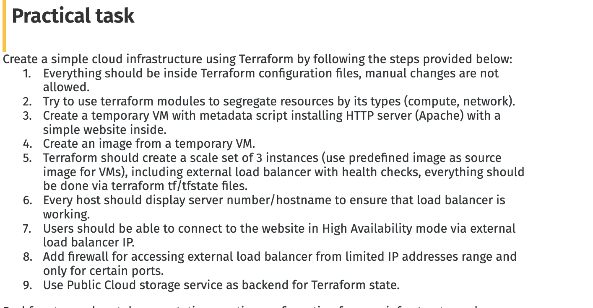

## Project Structure

```text
terraform/
├── main.tf              # Root configuration (calls modules)
├── variables.tf         # Global variables
└── modules/
    ├── network/
    │   └── vpc.tf       # VPC, Subnet, Firewall
    └── compute/
        └── main.tf      # VM, Snapshot, Image, Instance Group, Load Balancer
```

Before managing the bucket via Terraform, the GCP bucket `ar-terraform-bucket` was created manually

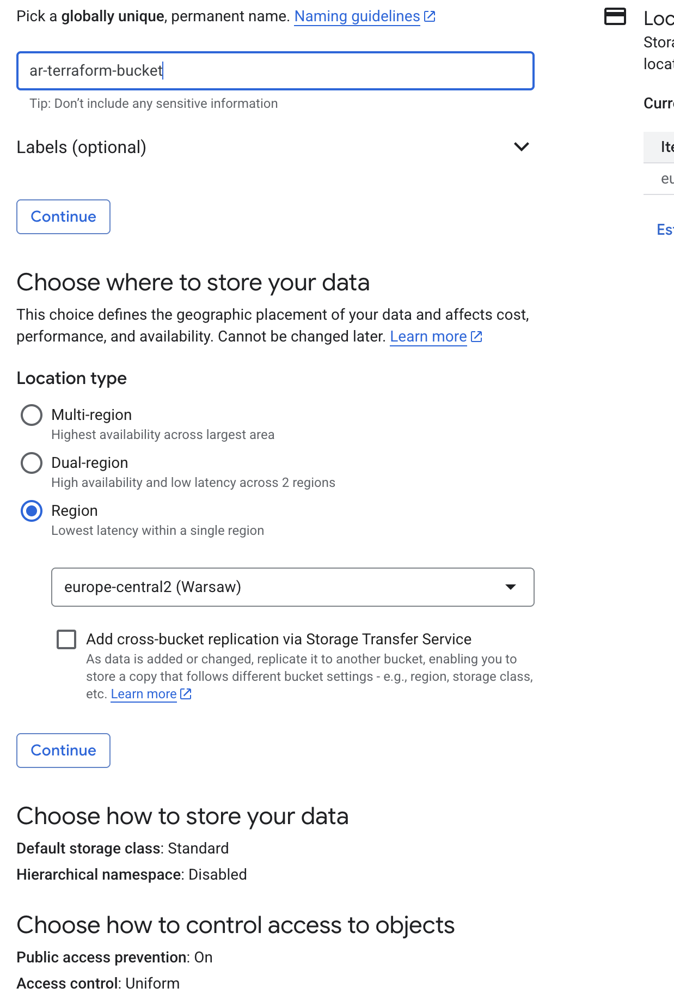

### 1. variables.tf

```terraform

variable "project_id" {
  default = "gd-gcp-internship-devops"
}

variable "region" {
  default = "europe-central2"
}

variable "zone" {
  default = "europe-central2-a"
}

variable "allowed_ips" {
  type        = list(string)
  description = "Allowed IPs for firewall"
  default     = []
}
```
### 2. Compute module

- Created a **temporary VM** (`temp_vm`) with a startup script installing Apache and serving `Hello from $(hostname)`.
- Built an **Instance Template** using the custom image.
- Created a **Managed Instance Group (MIG)** of 3 replicas for  availability.
- Added a **minimal health check** for port 80.
- Configured the **Backend Service**, **Target HTTP Proxy**, and **Forwarding Rule** to expose external IP.

```
# vm with apache for snapshot
resource "google_compute_instance" "temp_vm" {
  name         = "ar-terraform-vm"
  machine_type = "e2-micro"
  zone         = var.zone

  boot_disk {
    initialize_params {
      image = "debian-cloud/debian-12"
    }
  }

  network_interface {
    network    = var.vpc_network
    subnetwork = var.subnet
    access_config {}
  }

  metadata_startup_script = <<-EOT
    #!/bin/bash
    apt-get update
    apt-get install -y apache2
    echo "Hello from $(hostname)" > /var/www/html/index.html
    systemctl enable apache2
    systemctl start apache2
  EOT
}

# snapshot of the temp VM's disk
resource "google_compute_snapshot" "temp_snapshot" {
  name        = "ar-temp-snapshot"
  source_disk = google_compute_instance.temp_vm.boot_disk[0].source
  zone        = var.zone

  depends_on = [google_compute_instance.temp_vm]
}

# image from the snapshot 
resource "google_compute_image" "custom_image" {
  name            = "ar-custom-http-image"
  source_snapshot = google_compute_snapshot.temp_snapshot.id
}

# instance template 
resource "google_compute_instance_template" "web_template" {
  name         = "ar-web-template"
  machine_type = "e2-micro"

  disk {
    boot         = true
    source_image = google_compute_image.custom_image.self_link
    auto_delete  = true
  }

  network_interface {
    network    = var.vpc_network
    subnetwork = var.subnet
    access_config {}
  }

  metadata_startup_script = <<-EOT
    #!/bin/bash
    apt-get update
    apt-get install -y apache2
    echo "Hello from $(hostname)" > /var/www/html/index.html
    systemctl enable apache2
    systemctl start apache2
  EOT
}

# instance group
resource "google_compute_region_instance_group_manager" "web_mig" {
  name               = "ar-web-mig"
  region             = var.region
  base_instance_name = "web"
  target_size        = 3

  version {
    instance_template = google_compute_instance_template.web_template.self_link
  }

  named_port {
    name = "http"
    port = 80
  }

  # auto-healing using the health check
  auto_healing_policies {
    health_check      = google_compute_health_check.web_hc.id
    initial_delay_sec = 120
  }
  depends_on = [google_compute_instance_template.web_template]
}

# health check 
resource "google_compute_health_check" "web_hc" {
  name                = "ar-web-hc"
  check_interval_sec  = 10
  timeout_sec         = 5
  healthy_threshold   = 2
  unhealthy_threshold = 3

  http_health_check {
    port = 80
  }
}

# backend service for lb
resource "google_compute_backend_service" "web_backend" {
  name      = "ar-web-backend"
  protocol  = "HTTP"
  port_name = "http"

  health_checks = [google_compute_health_check.web_hc.id]

  backend {
    group = google_compute_region_instance_group_manager.web_mig.instance_group
  }
}

# URL map to backend service
resource "google_compute_url_map" "web_url_map" {
  name            = "ar-web-url-map"
  default_service = google_compute_backend_service.web_backend.id
}

resource "google_compute_target_http_proxy" "web_proxy" {
  name    = "ar-web-http-proxy"
  url_map = google_compute_url_map.web_url_map.id
}

resource "google_compute_global_forwarding_rule" "web_fwd" {
  name       = "ar-web-fwd"
  target     = google_compute_target_http_proxy.web_proxy.id
  port_range = "80"
}

# # optional: bucket 
# resource "google_storage_bucket" "my_bucket" {
#   name     = "aropt-terraform-bucket"
#   location = var.region
# }

# Output LB IP
output "load_balancer_ip" {
  value = google_compute_global_forwarding_rule.web_fwd.ip_address
}

```

### 2. Build Network Module (`modules/network/vpc.tf`)
- Created a **custom VPC** and **subnet**.
- Added a **firewall rule** to allow HTTP/HTTPS only from allowed IPs.
- Outputs `vpc_network` and `subnet` so the compute module can use them
```

#  custom VPC network
resource "google_compute_network" "vpc_network" {
  name                    = "artf-vpc-network"
  auto_create_subnetworks = false
}

#  subnet within the VPC
resource "google_compute_subnetwork" "subnet" {
  name          = "ar-tf-subnet"
  ip_cidr_range = "10.0.0.0/24"
  region        = var.region
  network       = google_compute_network.vpc_network.id
}

#  firewall rule 
resource "google_compute_firewall" "allow_lb" {
  name    = "ar-allow-lb-access"
  network = google_compute_network.vpc_network.id

  allow {
    protocol = "tcp"
    ports    = ["80", "443"]
  }

  source_ranges = var.allowed_ips
}
output "vpc_network" {
  value = google_compute_network.vpc_network.name
}

output "subnet" {
  value = google_compute_subnetwork.subnet.name
}

variable "region" {
  default = "europe-central2"
}
variable "allowed_ips" {
  default = ["0.0.0.0/0"]
}
```

### 4. Use Modules in `main.tf`         

- Called `network` and `compute` modules in the root `main.tf`.

```terraform
terraform {
  backend "gcs" {
    bucket = "ar-terraform-bucket"
    prefix = "terraform/state"
  }

  required_providers {
    google = {
      source  = "hashicorp/google"
      version = "6.8.0"
    }
  }
}

provider "google" {
  project = var.project_id
  region  = var.region
  zone    = var.zone
}

module "network" {
  source = "./modules/network"
  region = var.region
}

module "compute" {
  source      = "./modules/compute"
  zone        = var.zone
  region      = var.region
  vpc_network = module.network.vpc_network
  subnet      = module.network.subnet
}

output "load_balancer_ip" {
  value       = module.compute.load_balancer_ip
  description = "IP of Load Balancer"
}
```
- Passed variables and outputs appropriately to connect network and compute resources.

### Verify

**State File in GCP Bucket**  
   - Terraform stores all resource states in the configured GCS bucket backend.
   
After planning and applying, verify output – get the load balancer IP:
```
terraform output load_balancer_ip
```

Page content confirms which instance served the request
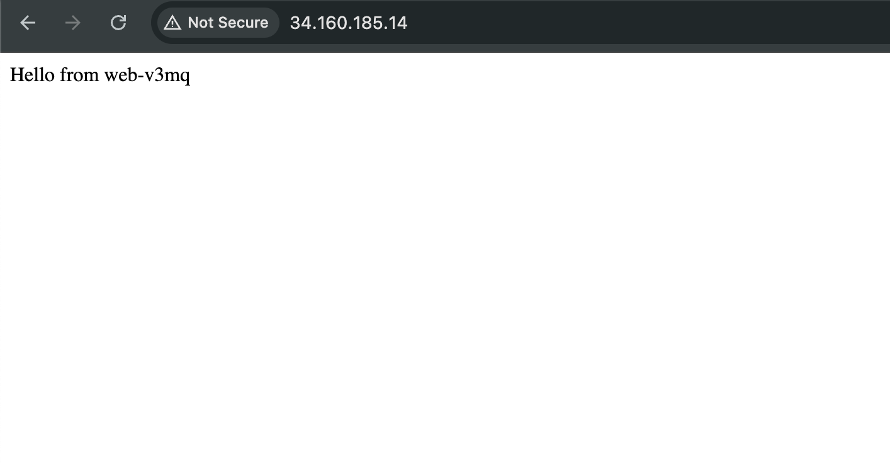


### Note on Terraform State and Locking

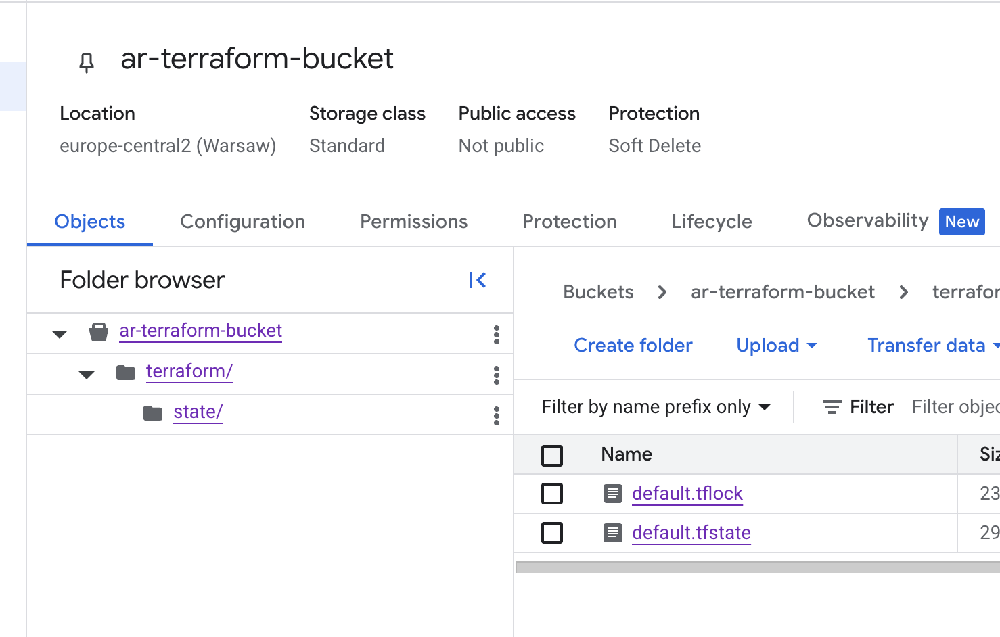

- **Local Backend** (`terraform.tfstate`):
  - No automatic locking
  - If multiple processes run Terraform simultaneously, the state file may get corrupted

- **Remote Backend**
  - Terraform automatically locks the state during `apply` and `destroy` to prevent concurrent modifications.
  - After `destroy`, the state file in the bucket remains but resource blocks are removed and outputs are set to `null`.
  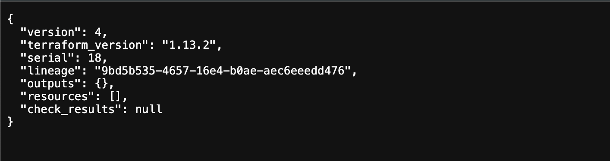

## Optional Task: Manage GCS Bucket without deleting it from infrastructure

create a GCS bucket via Terraform, remove it from Terraform management without deleting it, and then re-import it back into Terraform.

---

```terraform
resource "google_storage_bucket" "my_bucket" {
  name          = "aropt-terraform-bucket"
  location      = var.region
  force_destroy = false
}
```
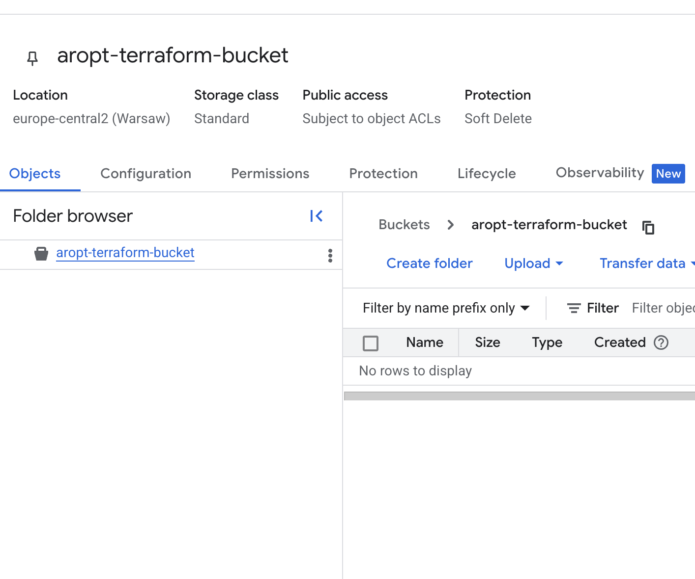

---

Remove bucket from Terraform state (without deleting in GCP)

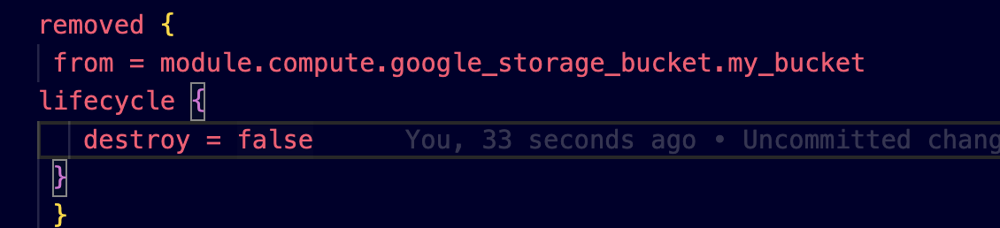
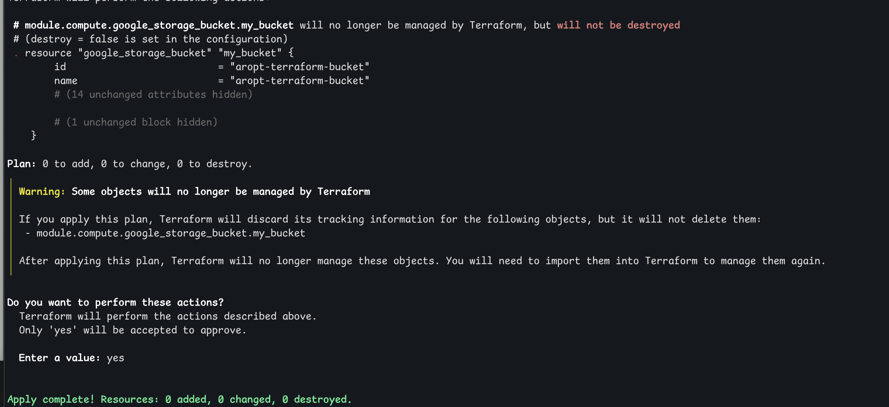
---

Re-add bucket to Terraform without creating a new one

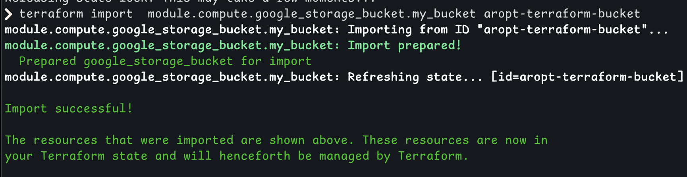
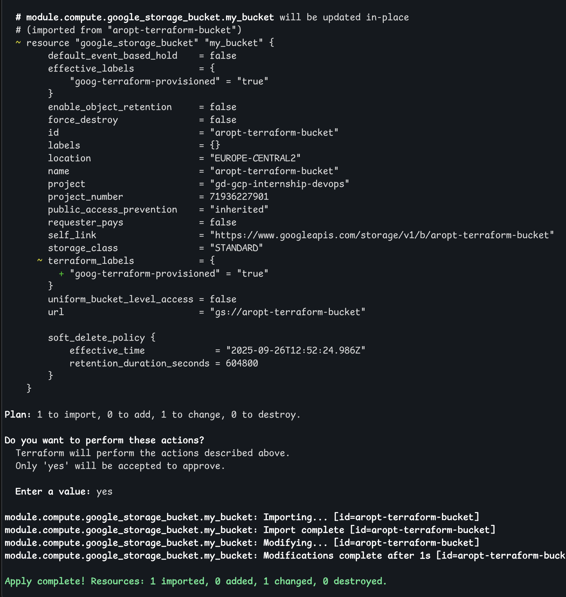
---

### There is also 

1. `terraform state rm` removes a resource from the Terraform state **without deleting it in the cloud**.  
2. `terraform import` brings existing resources under Terraform management  


### Source ranges 
 
The load balancer and instances are accessible only from:
- My current public IP (defined via `TF_VAR_allowed_ips` in `.zshrc`)
- Google Cloud health check IP ranges 

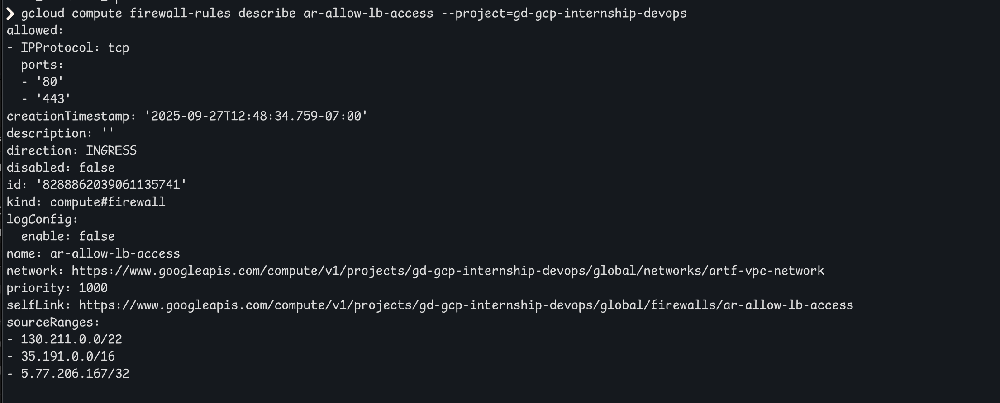

### Health check time-out possible issue and fix 
```
resource "google_compute_health_check" "web_hc" {
  name                = "ar-web-hc"
  check_interval_sec  = 10
  timeout_sec         = 5
  healthy_threshold   = 2
  unhealthy_threshold = 3

  http_health_check {
    port = 80
  }
}
```
