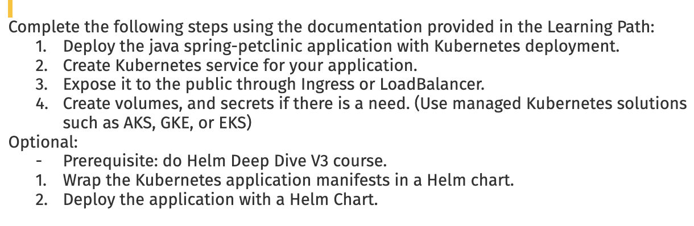
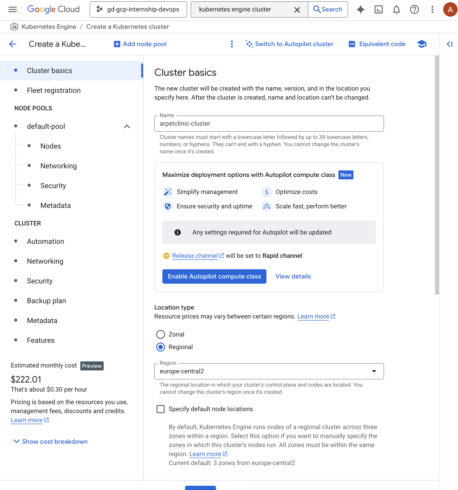
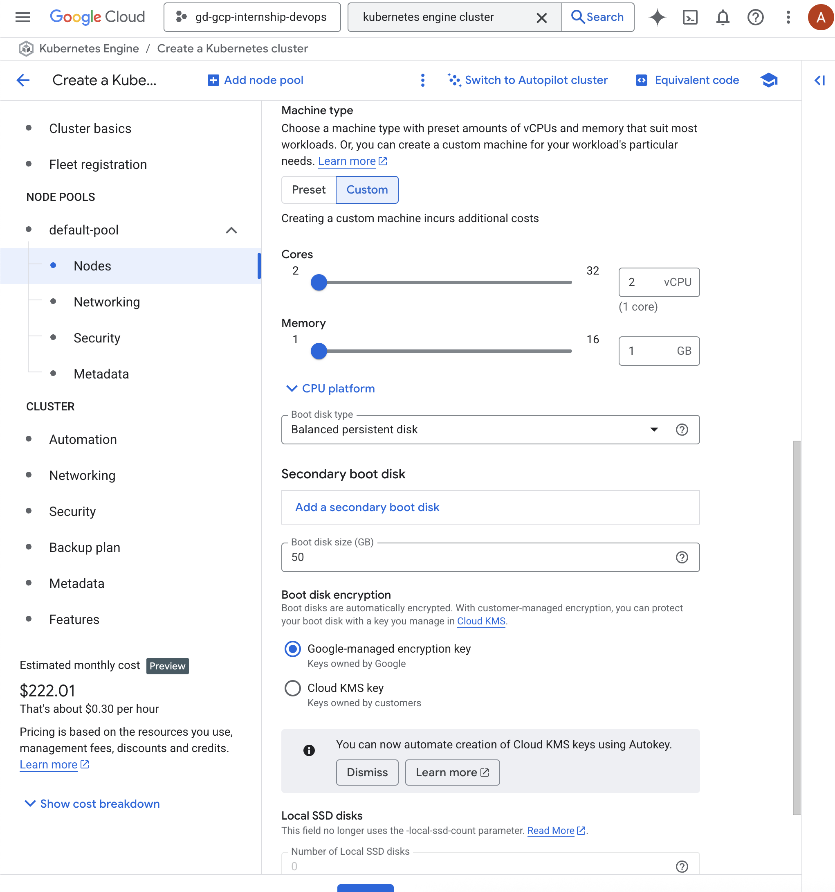
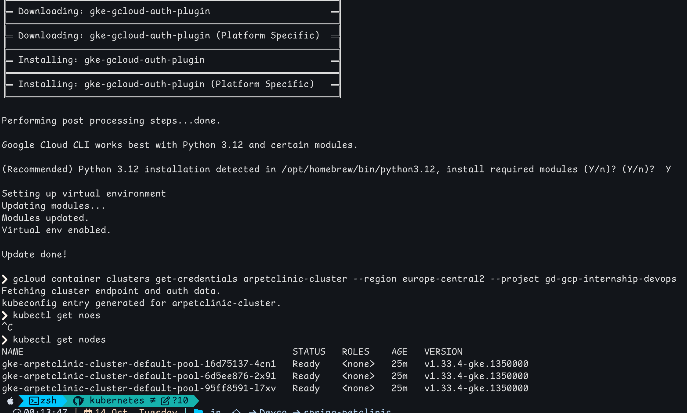
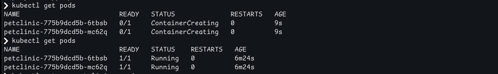
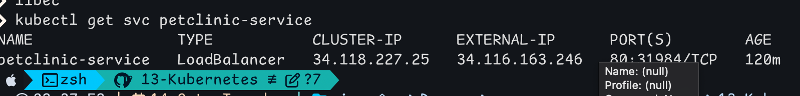
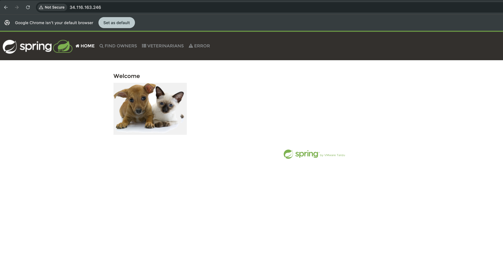
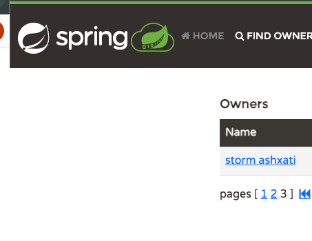

# Spring PetClinic Deployment on GKE

## Task



## **1. Create GKE Cluster**





---

## **2. Installed GKE Auth Plugin**

```bash
gcloud components install gke-gcloud-auth-plugin

gcloud container clusters get-credentials arpetclinic-cluster --region europe-central2 --project gd-gcp-internship-devops
```




## **3. Build Kubernetes**

deployment.yaml

```yaml
apiVersion: apps/v1
kind: Deployment
metadata:
  name: petclinic
  namespace: petclinic-ns
  labels:
    app: petclinic
spec:
  replicas: 2
  selector:
    matchLabels:
      app: petclinic
  template:
    metadata:
      labels:
        app: petclinic
    spec:
      containers:
      - name: petclinic
        image: europe-central2-docker.pkg.dev/gd-gcp-internship-devops/arpetclinic-repo/spring-petclinic-ar:v1.0.0
        ports:
        - containerPort: 8080
        #secrets
        envFrom:
        - secretRef:
            name: petclinic-db-secret

        #health
        readinessProbe:
          httpGet:
            path: /actuator/health/readiness
            port: 8080
          initialDelaySeconds: 10
          periodSeconds: 5
        livenessProbe:
          httpGet:
            path: /actuator/health/liveness
            port: 8080
          initialDelaySeconds: 15
          periodSeconds: 5
        resources:
          requests:
            memory: "512Mi"
            cpu: "250m"
          limits:
            memory: "1Gi"
            cpu: "500m"

      volumes:
      - name: petclinic-storage
        emptyDir: {}

```
Service (service.yaml)

```yaml
apiVersion: v1
kind: Service
metadata:
  name: petclinic-service
spec:
  selector:
    app: petclinic
  ports:
    - protocol: TCP
      port: 80
      targetPort: 8080
  type: LoadBalancer
  ```

  db.yaml
```yaml
apiVersion: v1
kind: Secret
metadata:
  name: postgres-secret
  namespace: default
type: Opaque
data:
  POSTGRES_USER: cGV0Y2xpbmlj
  POSTGRES_PASSWORD: cGV0Y2xpbmlj
  POSTGRES_DB: cGV0Y2xpbmlj

---
apiVersion: v1
kind: Service
metadata:
  name: postgres-service
  namespace: default
spec:
  ports:
    - port: 5432
      targetPort: 5432
  selector:
    app: postgres
  clusterIP: None   

---
apiVersion: apps/v1
kind: StatefulSet
metadata:
  name: postgres
  namespace: default
spec:
  serviceName: postgres-service
  replicas: 1
  selector:
    matchLabels:
      app: postgres
  template:
    metadata:
      labels:
        app: postgres
    spec:
      containers:
      - name: postgres
        image: postgres:15-alpine
        ports:
          - containerPort: 5432
        env:
          - name: POSTGRES_DB
            valueFrom:
              secretKeyRef:
                name: postgres-secret
                key: POSTGRES_DB
          - name: POSTGRES_USER
            valueFrom:
              secretKeyRef:
                name: postgres-secret
                key: POSTGRES_USER
          - name: POSTGRES_PASSWORD
            valueFrom:
              secretKeyRef:
                name: postgres-secret
                key: POSTGRES_PASSWORD
          - name: PGDATA
            value: /var/lib/postgresql/data/pgdata
        volumeMounts:
          - name: postgres-storage
            mountPath: /var/lib/postgresql/data
  volumeClaimTemplates:
    - metadata:
        name: postgres-storage
      spec:
        accessModes: ["ReadWriteOnce"]
        resources:
          requests:
            storage: 1Gi
```
## **4. Apply** 

kubectl apply -f deployment.yaml
kubectl apply -f service.yaml

```kubectl get svc petclinic-service```



⸻

## **5. Verify**





Added custom owner to check if PVC works, after restart owner it wasn't deleted 



### Issues & Fixes

| Issue | Cause | Fix |
|-------|-------|-----|
| **PostgreSQL fails to start (`directory is not empty`)** | Mounted volume contains default `lost+found` folder | Set custom data path:<br>`PGDATA=/var/lib/postgresql/data/pgdata` |
| **App can’t connect to Postgres** | No DB configuration in Deployment | Add to proper secrets to deployment
| **DB data lost after pod restart** | No PersistentVolume used | Use StatefulSet + PVC for postgres (volumeClaimTemplates) |
