# Task


---

## 1. Dockerfile Updates

- Added JMX Prometheus Exporter java agent to the dockerfile
- Exposed port **9404** for the exporter metrics
- Updated `ENTRYPOINT` to include the `-javaagent` flag for JMX metrics collection

```dockerfile
FROM maven:3-eclipse-temurin-21 AS build

WORKDIR /app

COPY pom.xml .
COPY src ./src

RUN mvn clean package -DskipTests -B -Dmaven.wagon.http.retryHandler.count=5

FROM eclipse-temurin:21-jre

WORKDIR /app

ADD https://repo1.maven.org/maven2/io/prometheus/jmx/jmx_prometheus_javaagent/0.20.0/jmx_prometheus_javaagent-0.20.0.jar /jmx.jar

COPY jmx_exporter_config.yaml /config/jmx.yaml
COPY --from=build /app/target/*.jar app.jar

EXPOSE 8080
EXPOSE 9404

ENTRYPOINT ["java", "-javaagent:/jmx.jar=9404:/config/jmx.yaml", "-Djava.awt.headless=true", "-jar", "app.jar"]

```

---

## 2. Docker Compose Updates

- Added **Prometheus** container
  -  JMX metrics from Spring Petclinic (`spring-petclinic:9404`).
  - Exposed on port **9090**.
- Added **Grafana** container
  - Exposed on port **3000**
  - Ensure that prometheus is running before starting
  

```yaml
services:
  spring-petclinic:
    build:
      context: ./
    image: spring-petclinic:latest
    ports:
      - "8079:8080"     
      - "9404:9404"     
    networks:
      - spring-network
    privileged: true            
    volumes:
      - /proc:/host_proc:ro     

  prometheus:
    image: prom/prometheus:latest
    container_name: prometheus
    ports:
      - "9090:9090"
    volumes:
      - ./prometheus.yml:/etc/prometheus/prometheus.yml
    networks:
      - spring-network
    depends_on:
      - spring-petclinic

  grafana:
    image: grafana/grafana:latest
    container_name: grafana
    ports:
      - "3000:3000"
    volumes:
      - grafana_data:/var/lib/grafana
    networks:
      - spring-network
    depends_on:
      - prometheus

volumes:
  grafana_data:

networks:
  spring-network:
    driver: bridge
```
---

## 3. Prometheus Configuration

Created prometheus.yml to configure Prometheus to collect metrics from Spring Petclinic.
scrape_configs defines what to monitor and job_name labels the job.
targets specifies the service endpoints exposing metrics

- `prometheus.yml` 

```yaml
scrape_configs:
  - job_name: "spring-petclinic-jmx"
    static_configs:
      - targets:
          - "spring-petclinic:9404"
```

---

## 4. Verification Steps

1. **Spring Petclinic**:
   -  ensure the application runs.
   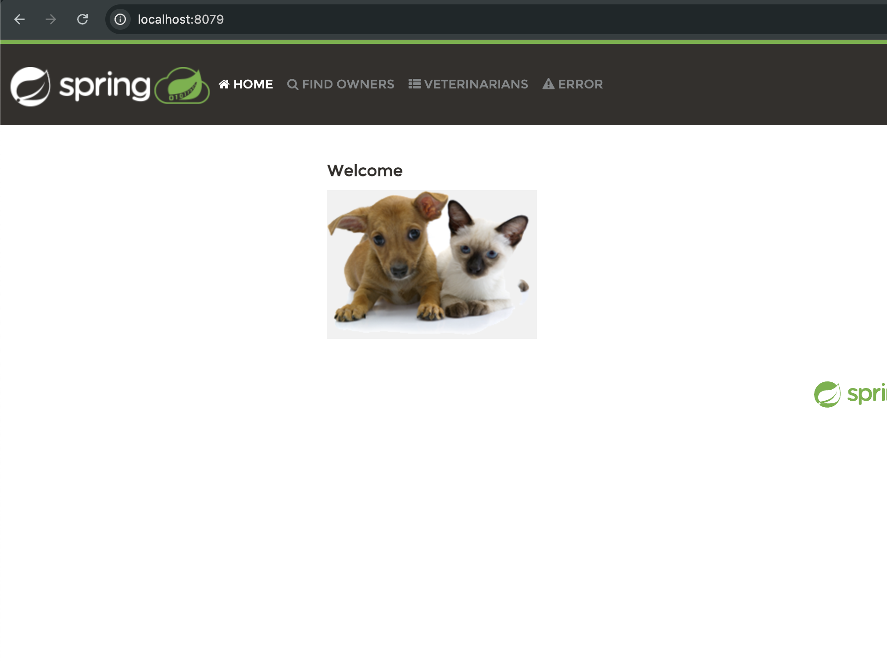
2. **JMX Exporter**:
   - verify metrics are displayed.
   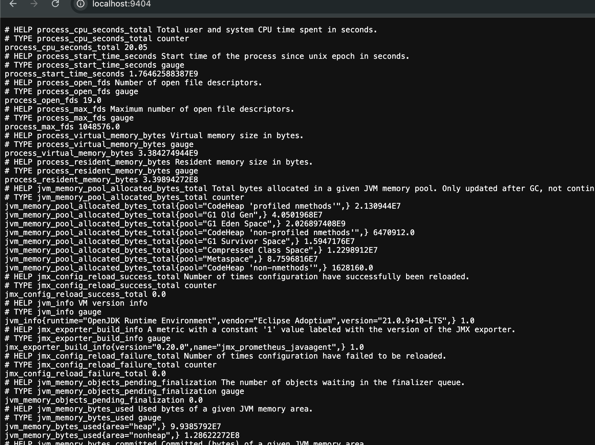
3. **Prometheus**:
   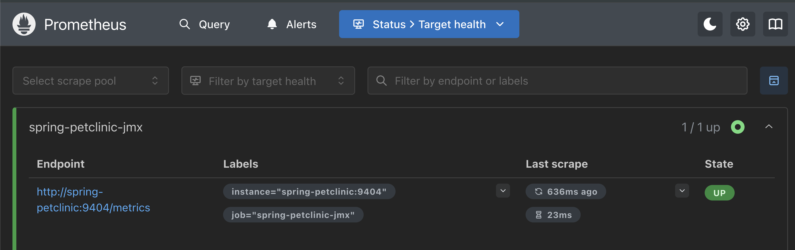
   - Run queries:
     - `java_lang_OperatingSystem_CpuLoad`
     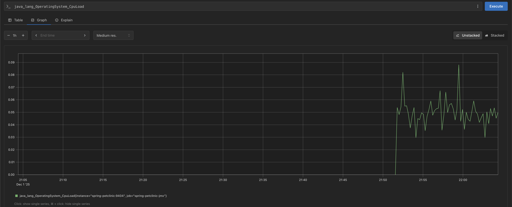
     - `java_lang_OperatingSystem_FreeMemorySize`
     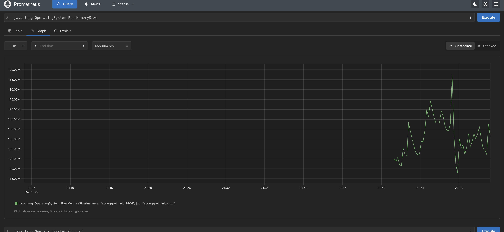
     - `java_lang_Memory_HeapMemoryUsage_used`
     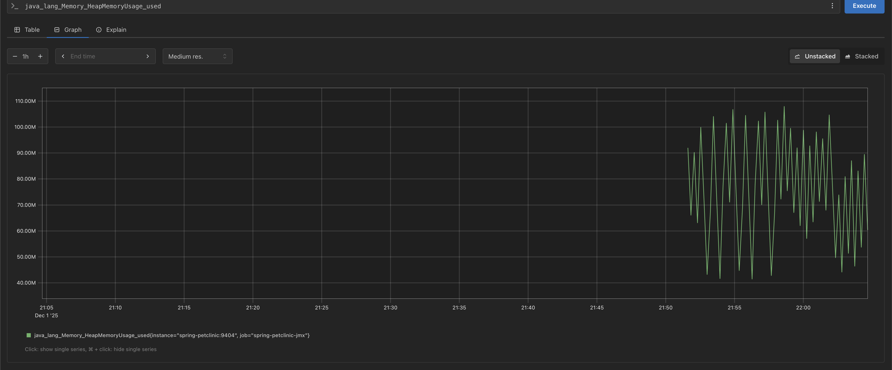
     - `java_lang_Runtime_Uptime`
     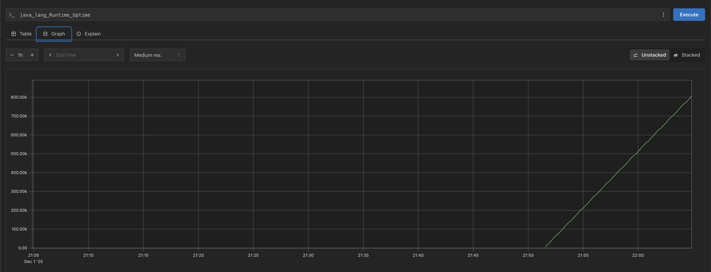
4. **Grafana**:
    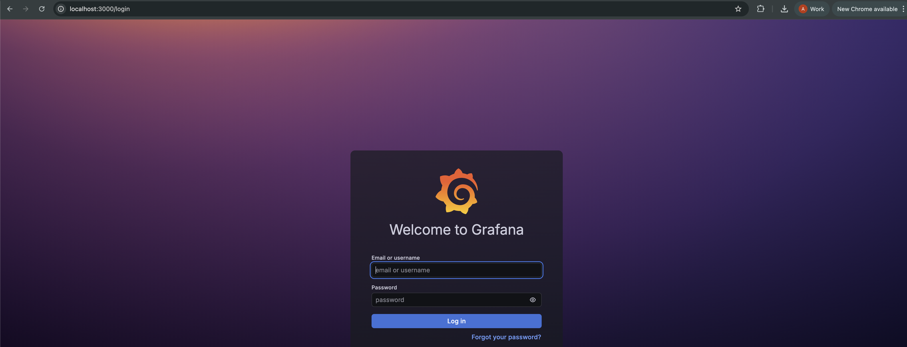
   - Open `http://localhost:3000`, add Prometheus as a data source (`http://prometheus:9090`)
   - Import dashboard **ID 10519** to visualize JVM metrics.
   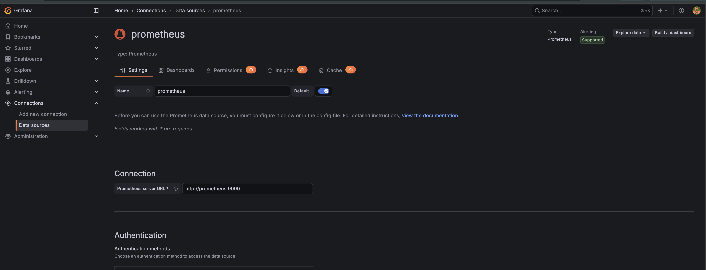

5. **Fixing broken panels**

Some Grafana panels were not displaying information correctly. I updated the PromQL queries in the affected panels to use simple, direct java_... JVM metrics, which resolved the issue and made the panels work correctly.
For example: instead of `os_free_physical_memory_bytes{job="$job",instance="$instance"}` I used `java_lang_OperatingSystem_FreePhysicalMemorySize` etc
<table>
  <tr>
    <th style="font-size:24px; text-align:center;">Before</th>
    <th style="font-size:24px; text-align:center;">After</th>
  </tr>
  <tr>
    <td>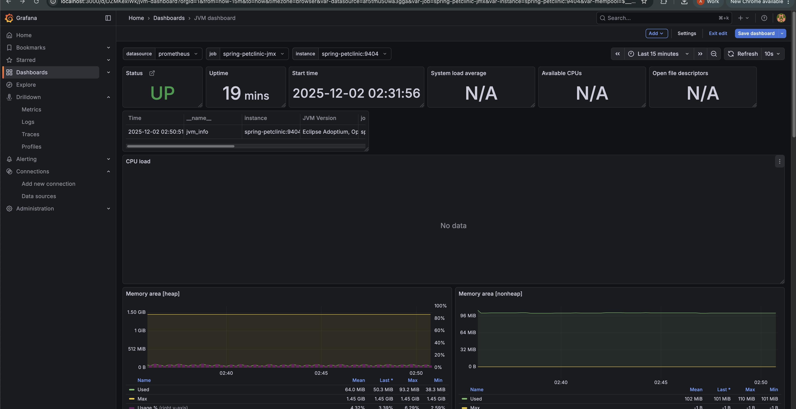</td>
    <td>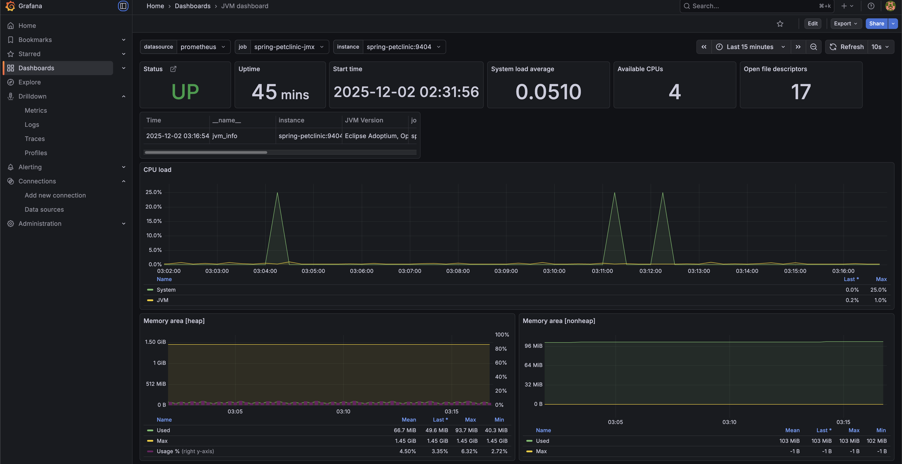</td>
  </tr>
  <tr>
    <td></td>
    <td>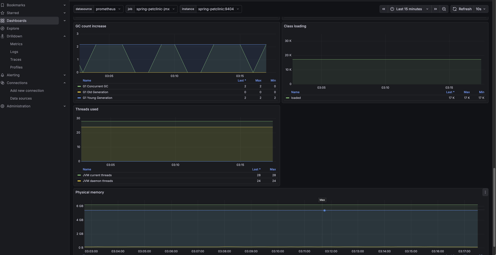</td>
  </tr>
</table>

---

## 5. Summary

- **Spring Petclinic Dockerfile** updated for JMX Prometheus Exporter.  
- **Prometheus and Grafana containers** added via Docker Compose.  
- Initially, some Grafana panels were not displaying metrics correctly. To troubleshoot, I experimented with different Docker base images:  
  - Tried building the application in a **smaller image** (Alpine-based Eclipse Temurin) to see if panel issues were caused because of alpine images.  
  - Switched to a **full OS image** and even added `privileged: true` in the Docker Compose setup.  
- None of these image changes solved the problem. The real cause was incorrect **PromQL** queries in the broken panels. Replacing them with simple, direct  queries fixed the issue c:
