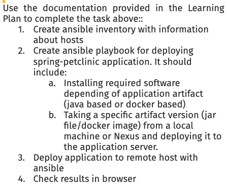
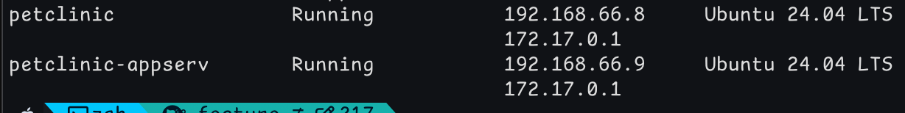
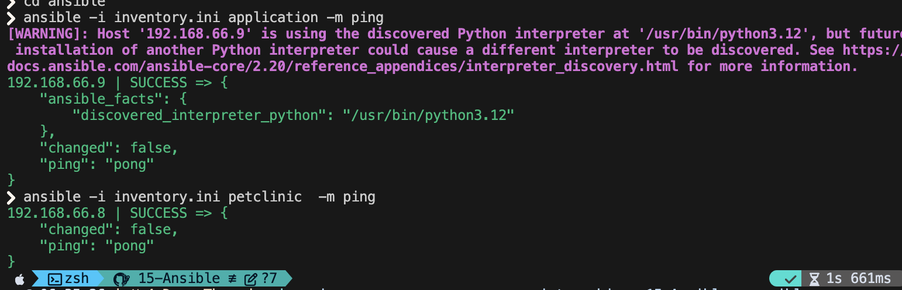
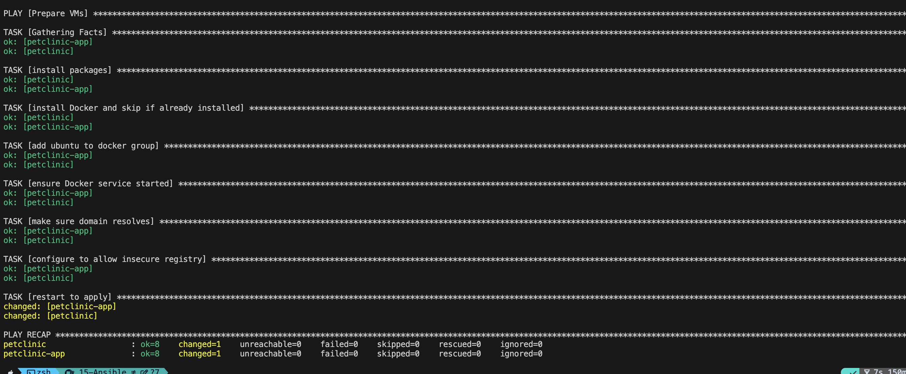
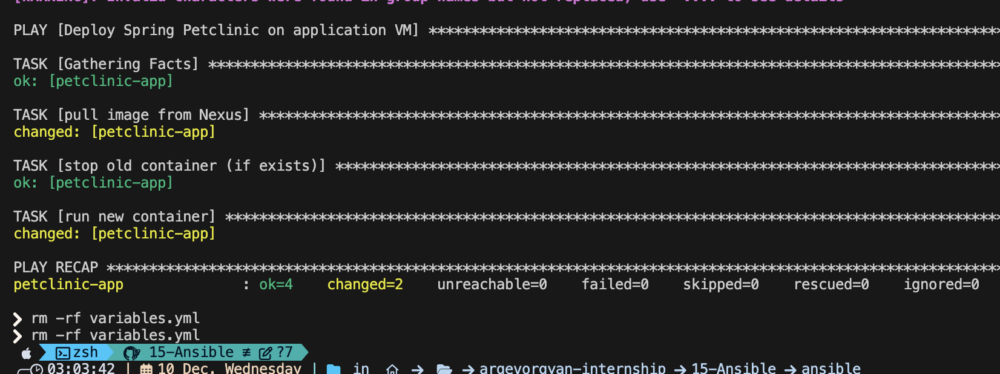

# Spring Petclinic Deployment with Ansible and Multipass



---

## Overview

## 1. Created two Multipass VMs:
   - `petclinic` – setup VM
   - `petclinic-appserv` – application VM
   


## 2. created `all.yml` file and stored variables in it

## 3. created `inventory.ini` for the Ansbile and checked if it pings properly to vms
(note) all configuration for the hosts are in the variables file such as ansible_ssh_private_key_file or ansible_user and ip at last

```yml
[petclinic-builder]     # buidler vm 
petclinic

[application]   # application server vm 
petclinic-app
```



## 4. Prepared VMs with required software 

```yml
- name: Prepare VMs
  hosts: all
  become: yes

  tasks:
    - name:  install packages
      apt:
        name:
          - apt-transport-https
          - ca-certificates
          - curl
        state: present
        update_cache: yes

    - name:  install Docker and skip if already installed
      shell: curl -fsSL https://get.docker.com | sh
      args:
        creates: /usr/bin/docker

    - name: add ubuntu to docker group
      user:
        name: ubuntu
        groups: docker
        append: yes

    - name: ensure Docker service started
      service:
        name: docker
        state: started
        enabled: yes

    - name: make sure domain resolves 
      lineinfile:
        path: /etc/hosts
        line: "192.168.10.156 nexus.local.internship"
        state: present

    - name: configure to allow insecure registry 
      copy:
        dest: /etc/docker/daemon.json
        content: |
          {
            "insecure-registries" : ["nexus.local.internship:5001"]
          }
        owner: root
        group: root

    - name: restart to apply
      service:
        name: docker
        state: restarted
```



## 5. Pull and deploy Spring Petclinic image from Nexus registry.

```yml
- name: Deploy Spring Petclinic on application VM
  hosts: application
  become: yes

  tasks:
    - name: pull image from Nexus
      community.docker.docker_image:
        name: "{{ nexus_registry }}/{{ image_name }}"
        tag: "{{ image_tag }}"
        source: pull

    - name: stop old container (if exists)
      community.docker.docker_container:
        name: "{{ container_name }}"
        state: absent

    - name: run new container
      community.docker.docker_container:
        name: "{{ container_name }}"
        image: "{{ nexus_registry }}/{{ image_name }}:{{ image_tag }}"
        state: started
        restart_policy: always
        published_ports:
          - "{{ host_port }}:{{ app_port }}"
```



## 5. Verify the deployment in the browser.


