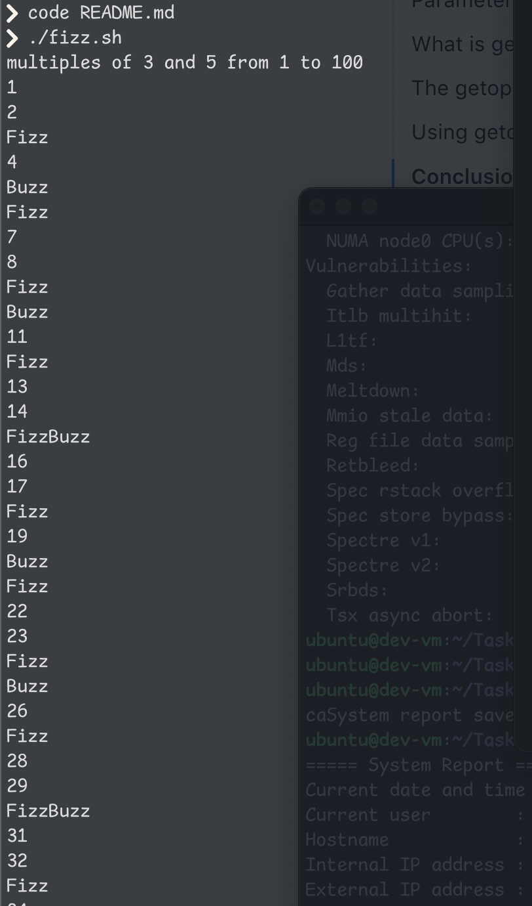

# FizzBuzz Bash Script
 prints numbers from 1 to 100 tagging multiples of 3 and 5

- If number is a multiple of 3, it prints `Fizz`.
- If number is a multiple of 5, it prints `Buzz`.
- If number is a multiple of both 3 and 5, it prints `FizzBuzz`.
- Otherwise it prints number itself

## How It Works

- I used loop to go through numbers from 1 to 100.
- if statements check each number using the mod(%) operator 
- Based on these conditions, the script prints `Fizz`, `Buzz`, `FizzBuzz`, or the number.

## Example Output
 