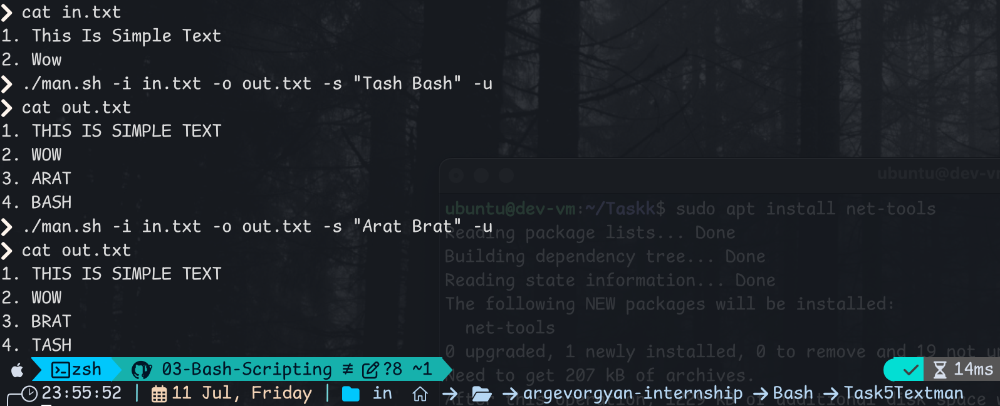
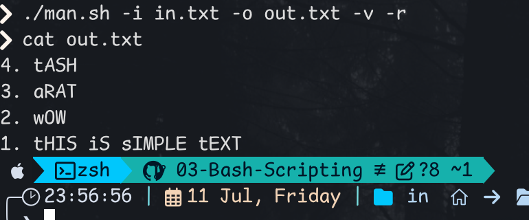

clear# Text File Transformer Script

This Bash script takes an input file and applies a series of optional text transformations based on flags. Content is saved to output file.

## Usage

```bash
./man.sh -i <input_file> -o <output_file> [options]
```
### Required Arguments

- `-i <input_file>`: Path to the input file.
- `-o <output_file>`: Path to the output file.

### Optional Flags

- `-s "A B"`: Substitute all occurrences of the string `A` with the string `B`.
- `-v`: Flips the case of all characters in the file (uppercase becomes lowercase and other way around).
- `-r`: Reverse the order of lines in the file.
- `-l`: Convert all letters to lowercase.
- `-u`: Convert all letters to uppercase.

>  If multiple case transformation flags (`-v`, `-l`, `-u`) are used together, they are applied in the order: `-v`, `-l`, `-u`.


## Examples

### Substitute text and make it uppercase:
```bash
./man.sh -i in.txt -o out.txt -s "Tash Bash" -u
```


### Flip and reverse order:
```bash
./man.sh -i in.txt -o out.txt -v -r
```


#### Note
Command tac works on my macOS system because of the installed `coreutils`. If you try to run it without installing it you will likely get an error.

