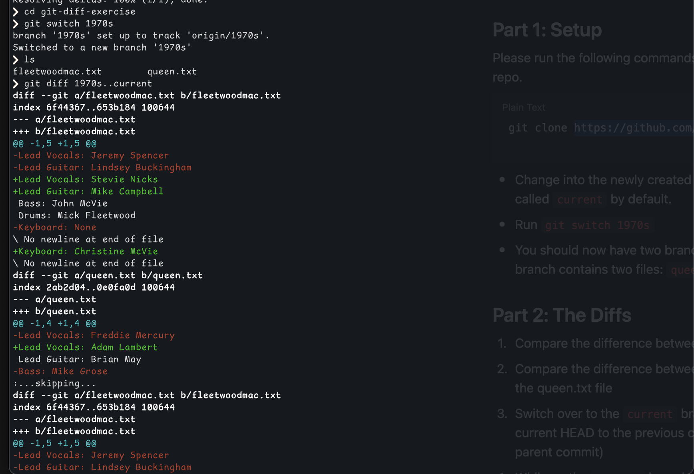
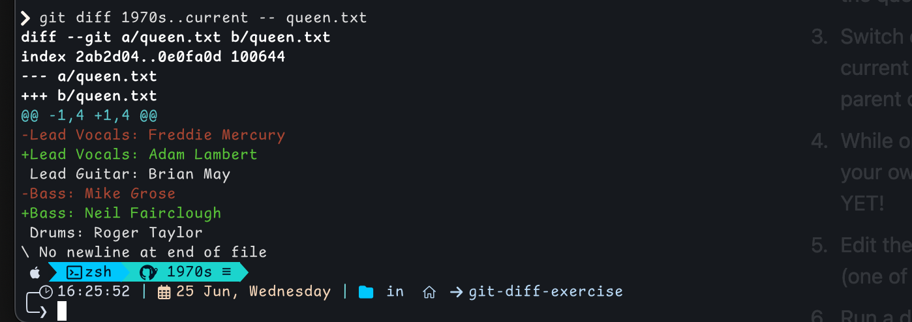
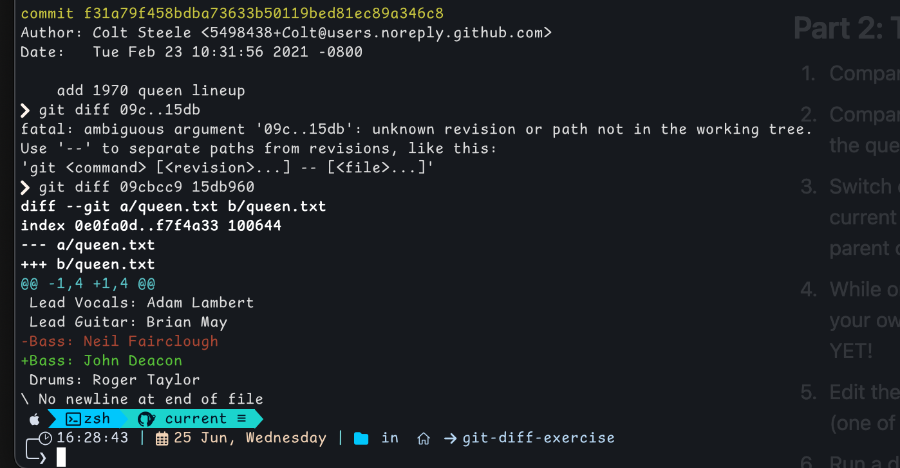
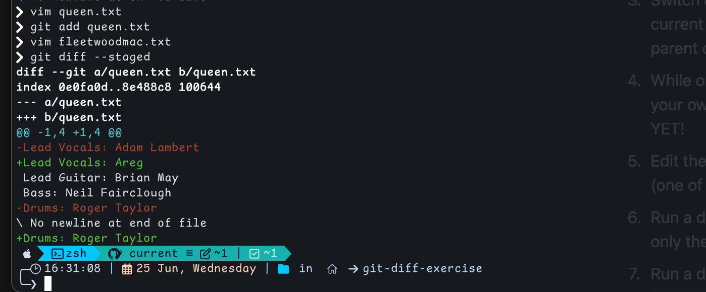
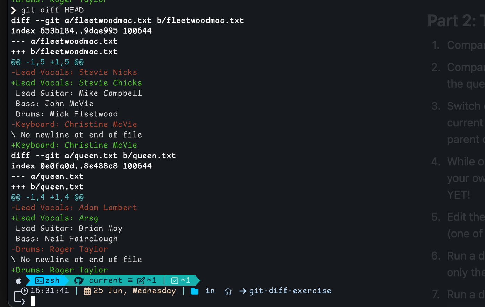

# Diff Exercise
summary of the `git diff` commands I used.  
Screenshots for each step are attached.

---

## Commands Used

- `git diff 1970s..current`  
  → compare files between the two branches.
  
- `git diff 1970s..current -- queen.txt`  
  → Compared only `queen.txt` between branches.
  
- `git diff 09cbcc9 15db960^`  
  → Compared last commit to the one before it.

- `git add queen.txt`  
  → Staged the change after editing Adam Lambert to my name.

- `git diff`  
  → Showed unstaged changes in `fleetwoodmac.txt`.

- `git diff --cached`  
  → Showed staged change in `queen.txt`.

- `git diff HEAD`  
  → Showed both staged and unstaged changes since last commit.

